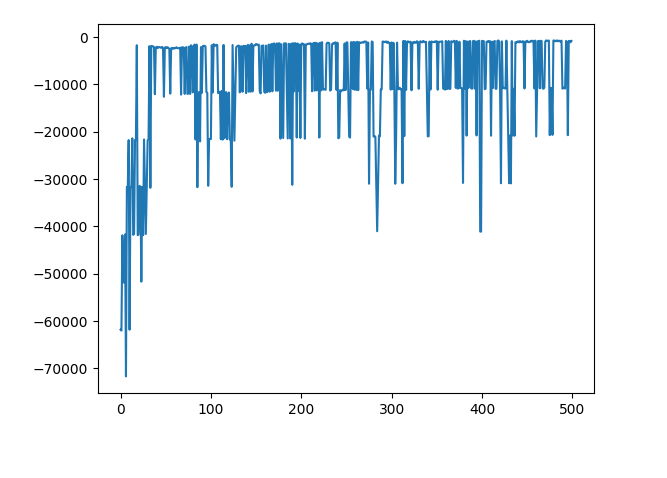
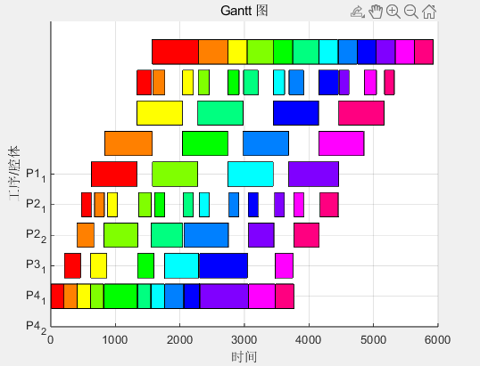
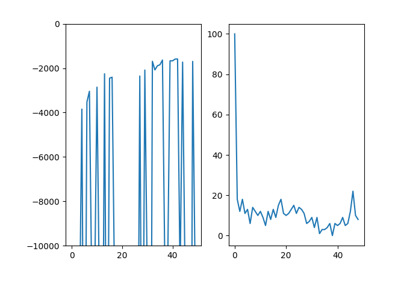

## Log

15日 基础环境
- 遇到死锁terminate
- find_te 生成动作掩码
- get_pre_pst N->(pre,pst)
 
16 日 
- [x] 设计潜势函数W(s)->剩余加工时间
- [x] 重构Petri网子类

17日
- [x] 对接CT环境

20日
- [x] 测试调整初始模型“Net.csv”，对齐序列后可以得到甘特图，但是没有到最优。增加batch之后到达最优附近
- [x] 测试毕设网模型：
  - 一开始死锁惩罚小500，导致模型故意陷入死锁达到奖励最大。解决方法：令死锁惩罚大于最短总时间（5500），
  10000的死锁惩罚可以让其跑完整个历程。
  - 增大sub_batch_size(256)后300个batch到达不了最优，放到autodl-4090也没办法加快训练速度。
  解决方法：减小sub_batch_size(64)，训练700个batch，最终可以达到5800左右的makespan。

21日
- [ ] 使用多智能体
- [ ] 局部观察
  -[x] 去掉闲置库所，使用部分观察进行训练。去掉起始库所和末端的库所observation=observation[1:-1]后
  还是可以收敛，并且50batch就可以到达最优附近，后面的训练主要收到死锁、死状态的困扰。**这里[1：-1]有问题
  限制库所不是最前面和最后面**
  -[x] 训练1个“死锁”检测模型。
    - step1 提取死锁标识、活标识（跑通的轨迹的标识一定是活标识）
    - step2 使用随机森林算法训练模型，分析库所重要性
    - step3 死锁标识进行聚类分析
- [x] **新思路**：目前想解决“如何识别坏标识”这个问题，在这个环境中，坏标识的产生有两种可能：某一个机器手
自己把自己卡住，另一种是两个机器手因为互相影响而卡住，针对第一种情况，可以在一个机器手发生死锁给一个惩罚。
根据得到的结果，这个思路好像让模型的最短时间变得更长了！！！
  - 通过观察10个batch里面的总deadlock数量，发现训练初期10个batch以内，死锁数很多，而且迅速下降。
  可以这样认为：**有一些死锁在初期已经被模型学会，剩下的死锁模型即使增加训练也无法识别、学习。**
- [ ] **训练时间加速思路**：每次模型terminated的时候重置到初始标识，因此走得很慢，可以这样想：因为我
是有一个潜势函数的，所以我可以按照加工进度往回退到某一个节点。
  - 思路一：随机热启动，模型重置后随机走k步，k in [min, max]
  - 思路二：从死锁处回退k步






### 描述


### Action Space

动作的大小 `(1,)`范围是`{0,21}` 表示Petri网中的变迁序号

#若需要考虑驻留时间约束，增加从使能开始的延迟时间t in [0,\infty]


### Observation Space

- 


### Reward


- 完成1道工序的加工+5
- 陷入死锁 -10
- 死状态 -10


很清楚：你的目标是**最小化总加工时间（makespan ）**。在强化学习里，把“时间”显式进奖励最稳。结合你已有规则（+5 完成、-10 死锁、-10 死状态），我给你一个**可直接落地的奖励模板**，兼顾“每步时间惩罚 + 潜势塑形 + 事件奖惩”。

#### 1) 基础：把时间作为每步惩罚

动作里已经有“执行时长 `Δt`”（你前面说过离散动作 + 连续时长）。
 用它直接施加线性时间成本：

- **每步时间惩罚**：`r_time = - c_time * Δt`
  - 推荐从 `c_time ∈ [0.02, 0.2]` 起试（单位：每秒/每时间单位），让“完成一单+5”的价值 ≈ 25–250 秒的时间；这样智能体会更偏向快完成而非磨蹭。

#### 2) 事件奖励

- **完成一道工序**：`+5`（若一件成品包含多工序，可按工序完成就给）
- **陷入死锁**：`-10`（并 `terminated=True`）
- **死状态**（不可行动、越界、无合法动作等）：`-10`（并 `terminated=True`）
- （可选）**无效动作/空转**：`-k_idle`，如 `-0.5` 每次，以免反复“空等”。

#### 3) 潜势塑形（强烈推荐，收敛更稳）

设计一个**潜势函数**表示“剩余工作量”。最简单是“**尚未完成的总标称工时**”：

- 令 `W(s)` = 所有未完成工序的**估计剩余加工时间**之和（可用工艺表里标准加工时长；已经启动的也按剩余算）。
- 定义潜势 `φ(s) = - W(s)`（越负表示剩余越多）。
- **潜势塑形奖励**：
   `r_potential = α * ( φ(s') - φ(s) ) = α * ( W(s) - W(s') )`
  - 它在完成一段有效加工（让剩余工时减少）时给出**额外正反馈**，相比单纯“完成后+5”更**稠密**、更易学。
  - 推荐 `α ∈ [0.5, 1.0]`，先用 `α=1.0`。

> 这样，即使一次动作只是把工件移动到更优机台、或减少了等待，也会得到正向信号（因为 `W(s') < W(s)`）。

#### 4) 终止时刻的特别处理

- **目标是最小化总加工时间**：当所有订单完成时终止，额外不必再给大额 bonus，因为整段过程中已经付了 `-c_time * Δt` 的“时间账单”，它自然推动“越快越好”。
- 如果你希望更强的“快结束”驱动，可以在完成时给小额 `+R_done`（如 `+2~+5`），但注意不要让它大到鼓励“少做活就早结束”。

#### 5) 奖励总式（单步）

把以上合起来（一步执行后，从状态 s 到 s'）：

```
r = (- c_time * Δt)                           # 时间惩罚
    + α * ( W(s) - W(s') )                    # 潜势塑形（剩余工时减少的即时奖励）
    + 𝟙{完成工序}(+5)                         # 事件奖励（可按工序完成触发）
    + 𝟙{陷入死锁或死状态}(-10)                # 失败惩罚（并终止）
    + 𝟙{无效/空转}(-k_idle) (可选)
```

#### 6) 参数与尺度建议（很重要）

- 先定**时间单位**（秒或工艺拍），所有时长与 `W(s)` 用同一单位。
- 让“完成一工序”（+5）的量级≈几十到上百时间单位的负成本，从而**“用时间换奖励”**的性价比清晰：
   例如时间单位=秒，若 `c_time=0.05`，那 100 秒≈-5，与“完成+5”相当。
- `γ`（折扣因子）：PPO/DQN 常用 `γ=0.97~0.995`。makespan 目标偏长视野，推荐 `γ=0.99`。
- 避免**尺度失衡**：若你发现智能体宁可拖延也要凑“完成+5”，就**提高 `c_time`**；若智能体太激进导致错误多，就**略降 `c_time` / 提升失败罚**。

#### 7) 死锁/死状态的判定提示

- **死锁**：图搜索或等待图（resource allocation graph）检测循环；或“N 步内状态不变 + 有未完工件”判为死锁。
- **死状态**：无合法动作（动作掩码全 False）、越界、装备不可用且无法恢复等。

#### 8) 变体：如果你关心“交期/迟交”

若每件有**交期 `d_j`**，你可能更关心**总迟期** `∑ max(0, C_j - d_j)` 或**最大迟期**。
 可把潜势换成“剩余**迟期下界**”估计，或在终止时加：

- `r_due = - β * ∑ max(0, C_j - d_j)`（一次性扣除），或把它改成**逐步**的 `-β * tardiness_increment`（更稠密）。

#### 9) 代码骨架（环境内）

```python
def step(self, action):
    a_type = action["type"].item()
    dt     = float(action["duration"])  # 你的连续时间
    s  = self._state
    W_s = self._remaining_work(s)       # 总剩余工时(估计)

    # 应用动作、推进时间 dt，更新系统
    s_next, events = self._simulate(s, a_type, dt)
    W_sp = self._remaining_work(s_next)

    r = 0.0
    r += - self.c_time * dt
    r += self.alpha * (W_s - W_sp)
    if events.completed_ops > 0:
        r += 5.0 * events.completed_ops
    if events.deadlock:
        r += -10.0
        terminated = True
    elif events.dead_state:
        r += -10.0
        terminated = True
    else:
        terminated = self._all_done(s_next)

    return s_next, r, terminated, {}
```

#### 10) 常见坑 & 调参路线

- **梯度信号稀疏** → 打开潜势塑形（第 3 节），并在“移动/排队减少”也能降低 `W(s)`。
- **学会“磨洋工”** → 增大 `c_time` 或增加**空转惩罚**；限制 `Δt` 上限（太长会缺乏探索）。
- **频繁死锁** → 提高死锁惩罚到 `-15~-20`；加入**动作掩码**避免明显非法序列。
- **学到“少做活早结束”** → 终止条件必须是**全部工序完成**；不要给过大的终止 bonus。

------

如果你把工艺表（每工序标准时长/机台能力/搬运时间模型）简单描述一下，我可以按你的字段直接给一版**可运行的 TorchRL 环境 `EnvBase`**：包含 `action_spec`（离散+duration）、`W(s)` 计算、死锁检测占位与上述奖励实现。

