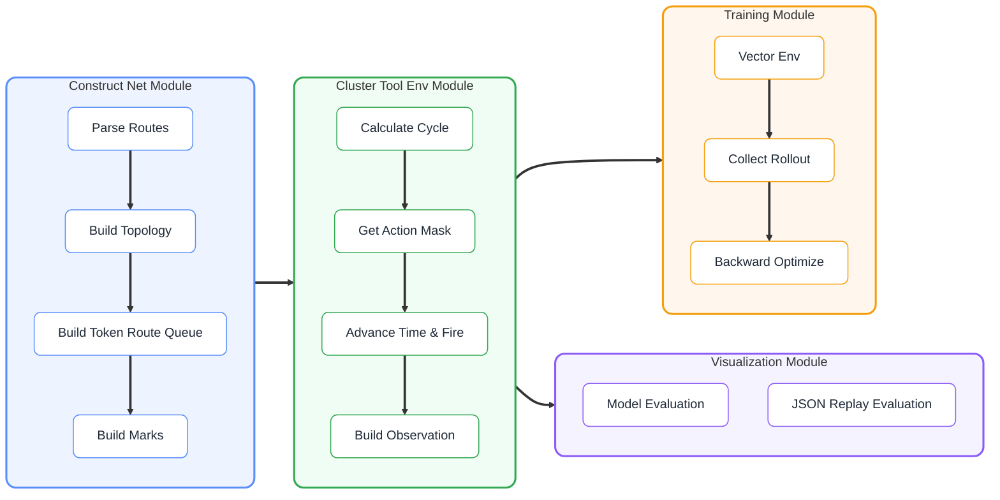

## Quickstart

在仓库根目录执行；**命令与行为细则以 `docs/` 为准**（本段为入口索引）。

| 目的 | 命令（示例） | 说明 |
|------|--------------|------|
| 级联单设备训练 | `python -m solutions.Continuous_model.train_single --device cascade --rollout-n-envs 1` | 训练配置：`data/ppo_configs/s_train.json`；可选 `--compute-device`（`cpu` 或 `cuda`）、`--checkpoint` |
| 强制 CPU 更新 | `python -m solutions.Continuous_model.train_single --device cascade --compute-device cpu` | 环境步进在 CPU 上，rollout 后再送入计算设备（见 `env_single` 说明） |
| 并发双机械手训练 | `python -m solutions.Continuous_model.train_concurrent --config data/ppo_configs/concurrent_phase2_config.json` | 跨机器时若默认 config 为绝对路径，请改为显式相对路径（见 `docs/training/training-guide.md`） |
| 导出推理序列 | `python -m solutions.Continuous_model.export_inference_sequence --device cascade --model <model_path>` | 默认写入 `seq/tmp.json`，含 `replay_env_overrides` |
| 可视化界面 | `python -m visualization.main --device cascade --model <model_path>` | 未传 `--model` 时若存在 `solutions/Continuous_model/saved_models/CT_single_phase2_best.pt` 会自动加载；`--no-model` 仅手动或 JSON 回放；`--quiet` 关闭逐步打印；`--debug` 显示变迁调试按钮 |

**说明**：`train_single` 的 CLI 默认 `--device` 为 `single`，但当前 `Env_PN_Single` 仅支持 **cascade**；请使用 `--device cascade`，与 `docs/training/training-guide.md` 一致，行为见 `docs/continuous-model/pn-single.md`。

**DocRef**：`docs/training/training-guide.md`、`docs/visualization/ui-guide.md`、`docs/overview/project-context.md`。

## Continuous_model 架构（概览）

下图描述 **cascade** 主路径上的构网、设备模拟、训练与可视化；并发双机械手见 `solutions/Continuous_model/pn.py` 与 `solutions/Continuous_model/train_concurrent.py`，以 `docs/` 为准。下方「历史 Log」可能与最新实现不一致时，**以 `docs/` 与源码为准**。

```mermaid
%%{
  init: {
    "flowchart": {
      "curve": "basis",
      "nodeSpacing": 42,
      "rankSpacing": 60
    },
    "theme": "base",
    "themeCSS": "
      .cluster-label text,
      .cluster-label span {
        font-size: 40px !important;
        font-weight: 700 !important;
      }
      .nodeLabel {
        font-size: 20px;
      }
    "
  }
}%%
flowchart LR

  subgraph net[Construct Net Module]
    direction TB
    A1[Parse Routes]
    A2[Build Topology]
    A3[Build Token Route Queue]
    A4[Build Marks]
    A1 --> A2 --> A3 --> A4
  end

  subgraph sim[Cluster Tool Env Module]
    direction TB
    B1[Calculate Cycle]
    B2[Get Action Mask]
    B3[Advance Time & Fire]
    B4[Build Observation]
    B1 --> B2 --> B3 --> B4
  end

  subgraph train[Training Module]
    direction TB
    C1[Vector Env]
    C2[Collect Rollout]
    C3[Backward Optimize]
    C1 --> C2 --> C3
  end

  subgraph viz[Visualization Module]
    direction TB
    D1[Model Evaluation]
    D2[JSON Replay Evaluation]
  end

  net --> sim
  sim --> train
  sim --> viz

  style net fill:#EEF4FF,stroke:#5B8FF9,stroke-width:2.5px,rx:12,ry:12
  style sim fill:#F0FDF4,stroke:#34A853,stroke-width:2.5px,rx:12,ry:12
  style train fill:#FFF7ED,stroke:#F59E0B,stroke-width:2.5px,rx:12,ry:12
  style viz fill:#F5F3FF,stroke:#8B5CF6,stroke-width:2.5px,rx:12,ry:12

  classDef netNode fill:#FFFFFF,stroke:#5B8FF9,stroke-width:1.2px,color:#1F2937,rx:8,ry:8;
  classDef simNode fill:#FFFFFF,stroke:#34A853,stroke-width:1.2px,color:#1F2937,rx:8,ry:8;
  classDef trainNode fill:#FFFFFF,stroke:#F59E0B,stroke-width:1.2px,color:#1F2937,rx:8,ry:8;
  classDef vizNode fill:#FFFFFF,stroke:#8B5CF6,stroke-width:1.2px,color:#1F2937,rx:8,ry:8;

  class A1,A2,A3,A4 netNode;
  class B1,B2,B3,B4 simNode;
  class C1,C2,C3 trainNode;
  class D1,D2 vizNode;

  linkStyle default stroke-width:3px;
```

**数据流（摘要）**

1. `data/petri_configs/`（如 `cascade.json`）经 `PetriEnvConfig` 提供构网与环境参数。
2. `construct_single.build_net`：固定拓扑 + route 编译 → token 路由队列 → `build_marks` 等产出 marks / `process_time_map`。
3. `pn_single.ClusterTool`：节拍与 `get_action_mask`、时间推进、`step`、reward。
4. `env_single.Env_PN_Single`：TorchRL 风格 `reset` / `step`、`action_mask`、观测张量。
5. `train_single` 做 rollout + PPO；`python -m visualization.main` 通过同一后端做在线模型或 JSON 回放。

**文件与模块映射**

| 层级 | 主要职责 | 主要文件 |
|------|----------|----------|
| 构网 | `route_config` 预处理；`compile_route_stages` / IR；`build_token_route_queue`；`build_marks_for_single_net`；`get_topology` | `solutions/Continuous_model/construct_single.py`、`construct/preprocess_config.py`、`construct/route_compiler_single.py`、`construct/build_route_queue.py`、`construct/build_marks.py`、`construct/build_topology.py` |
| 设备模拟 | `ClusterTool`：掩码、时间推进、reward；`Env_PN_Single`：`reset` / `step`、观测 | `solutions/Continuous_model/pn_single.py`、`solutions/Continuous_model/env_single.py` |
| 训练 | `VectorEnv` / `FastEnvWrapper`；`collect_rollout_ultra`；`MaskedPolicyHead` 与 masked 采样；优化器更新 | `solutions/Continuous_model/train_single.py`、`solutions/PPO/network/models.py` |
| 可视化 | CLI；`Env_PN_Single` 适配器；Model A 推理 / Model B JSON；PySide6 界面 | `visualization/main.py`、`visualization/petri_single_adapter.py`、`visualization/viewmodel.py`、`visualization/main_window.py`（细则见 `docs/visualization/ui-guide.md`） |
| 导出 | 写出回放用 JSON（含 `replay_env_overrides`），供可视化 Model B | `solutions/Continuous_model/export_inference_sequence.py` |

**DocRef**：`docs/continuous-model/pn-single.md`（构网链与「构网 → mask → step → reward」）。

## Docs

- docs/README.md：文档总入口（先读）
- docs/overview/project-context.md：项目描述与模块边界
- docs/continuous-model/pn-single.md：pn_single 主题文档
- docs/visualization/ui-guide.md：可视化主题文档
- docs/training/training-guide.md：训练主题文档
- docs/td-petri/td-petri-guide.md：td_petri 主题文档

