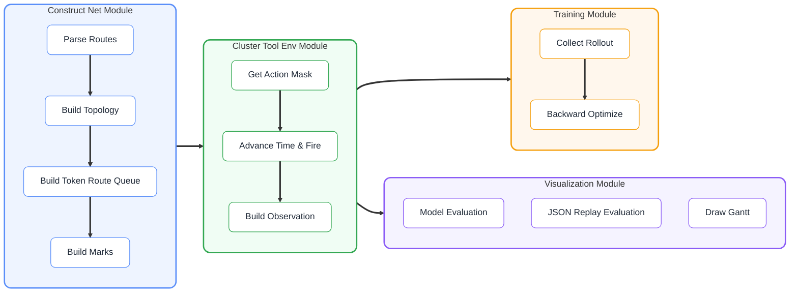

## TASK

- 优化模型（加速，并且可以得到最优解）
  - [ ] 2️⃣大气机器手子智能体: 在晶圆制造设备中,分为大气端和真空端.两者通过LLA和LLB连接.真空端的机器人我已经训练好了,是当前的continuous_model下的模型.我想要设计一个大气端机器手智能体的任务比较简单,将LP的晶圆送到AL,然后从AL送到LLA,将LLB处理好的晶圆送到LP_done.原来为了简化模型,将LLA和LLB分别作为真空端的起始点,命名为了LP和LP_done. 训练这个大气机器手智能体的时候不需要配合真空智能体使用,只需要将LLA的晶圆经过一个随机的时间后移动到LLB即可. 不同的腔体中用泊松分布生成到来的晶圆
- 增加物理约束
  - [ ] 处理两个机械臂并发时在buffer处产生冲突的问题
  - [ ] 重入
  - [ ] 旋转
- 模型训练加速
  - [ ] 找出瓶颈
  - [ ] 更换显卡
  - [ ] 优化强化学习模型

## Quickstart

在仓库根目录执行。下面 3 步是当前最小可用主路径：训练 `solutions.A`，导出动作序列，再启动可视化界面。

先安装依赖：

```bash
pip install -r requirements.txt
```

1. 训练 A 方案

```bash
python -m solutions.A.ppo_trainer --device cascade --rollout-n-envs 1 --artifact-dir quickstart
```

默认读取 `config/training/s_train.yaml`，并写出模型到 `results/models/quickstart_best.pt` 与 `results/models/quickstart_final.pt`。

2. 导出推理序列

```bash
python -m solutions.A.eval.export_inference_sequence --model results/models/quickstart_final.pt --out-name quickstart
```

输出文件为 `results/action_sequences/quickstart(W<晶圆数>-M<makespan>).json`（后缀由 `env.net.n_wafer` 与 `env.net.time` 组成）。

3. 启动可视化界面

```bash
python -m visualization.main --device cascade --model results/models/quickstart_final.pt
```

可视化依赖 `PySide6`。未传 `--model` 时会进入手动模式；如需回放导出的序列，在界面中加载 `results/action_sequences/` 下本次导出的 `quickstart(W…-M…).json`。

## 多路线批量训练与评估

若要一次性按多条路线执行并发训练与评估，先编辑 [solutions/A/eval/validate_all_routes.py](/D:/Code/CT/solutions/A/eval/validate_all_routes.py) 中的 `ROUTE_PLAN`。每条路线都必须同时填写 `train`、`eval` 和 `profile`；`profile` 只接受 `low` / `medium` / `high`，分别对应 `config/training/low.yaml`、`medium.yaml`、`high.yaml`。

```bash
python -m solutions.A.eval.validate_all_routes --rollout-n-envs 1
```

运行期间每条路线同一行动态刷新训练进度条，评估结束后在该行追加 `eval_pass=T/F`。最终会把汇总结果写到 `results/training_logs/validate_all_routes_summary.json`，其中包含每条路线的训练晶圆、best batch makespan、评估晶圆、评估 makespan、训练时间和评估动作序列路径。

如需轻量模式（不绘制甘特图和 `training_metrics_plot`）：

```bash
python -m solutions.A.eval.validate_all_routes --rollout-n-envs 1 --lite
```

轻量模式下每条路线评估完成会输出一行：
`<route_name> [<low|medium|high>] [########################] eval_pass=T/F`。
最终汇总表 `_format_summary_table(...)` 与输出 JSON 字段保持不变。

## Python 导入入口

`solutions` 顶层支持直接导入 `A` / `B` 下的无重名模块；重名模块不会扁平化到顶层。

```python
from solutions import A, B
from solutions import petri_net, rl_env, core, train
from solutions.A import construct
from solutions.B import construct
```

- `construct` 同时存在于 `A` 和 `B`，必须保留命名空间导入，不支持 `from solutions import construct`。
- `eval`、`deprecated` 仅存在于 `A`，可直接 `from solutions import eval, deprecated`。

## 输出路径规范（强制）

以下规则为仓库强制规范，后续新增/修改输出逻辑必须遵守：

1. 所有可重复生成的运行产物必须写入 `results/`。
2. 动作序列只写 `results/action_sequences/`。
3. 甘特图只写 `results/gantt/`。
4. 训练日志与训练指标只写 `results/training_logs/`。
5. 网拓扑缓存只写 `results/topology_cache/`。
6. 模型权重只写 `results/models/`。
7. 禁止新增写入 `seq/`、`saved_models/`、`data/cache/` 等旧路径。

## 架构（概览）

下图描述 **cascade** 主路径上的构网、设备模拟、训练与可视化；并发双机械手见 `solutions/Continuous_model/pn.py` 与 `solutions/Continuous_model/train_concurrent.py`，以 `docs/` 为准。下方「历史 Log」可能与最新实现不一致时，**以 `docs/` 与源码为准**。


```mermaid
%%{
  init: {
    "flowchart": {
      "curve": "basis",
      "nodeSpacing": 42,
      "rankSpacing": 60
    },
    "theme": "base",
    "themeCSS": "
      .cluster-label text,
      .cluster-label span {
        font-size: 40px !important;
        font-weight: 700 !important;
      }
      .nodeLabel {
        font-size: 20px;
      }
    "
  }
}%%
flowchart LR

  subgraph net[Construct Net Module]
    direction TB
    A1[Parse Routes]
    A2[Build Topology]
    A3[Build Token Route Queue]
    A4[Build Marks]
    A1 --> A2 --> A3 --> A4
  end

  subgraph sim[Cluster Tool Env Module]
    direction TB
    B2[Get Action Mask]
    B3[Advance Time & Fire]
    B4[Build Observation]
    B2 --> B3 --> B4
  end

  subgraph train[Training Module]
    direction TB
    C2[Collect Rollout]
    C3[Backward Optimize]
    C2 --> C3
  end

  subgraph viz[Visualization Module]
    direction TB
    D1[Model Evaluation]
    D2[JSON Replay Evaluation]
    D3[Draw Gantt]
  end

  net --> sim
  sim --> train
  sim --> viz

  style net fill:#EEF4FF,stroke:#5B8FF9,stroke-width:2.5px,rx:12,ry:12
  style sim fill:#F0FDF4,stroke:#34A853,stroke-width:2.5px,rx:12,ry:12
  style train fill:#FFF7ED,stroke:#F59E0B,stroke-width:2.5px,rx:12,ry:12
  style viz fill:#F5F3FF,stroke:#8B5CF6,stroke-width:2.5px,rx:12,ry:12

  classDef netNode fill:#FFFFFF,stroke:#5B8FF9,stroke-width:1.2px,color:#1F2937,rx:8,ry:8;
  classDef simNode fill:#FFFFFF,stroke:#34A853,stroke-width:1.2px,color:#1F2937,rx:8,ry:8;
  classDef trainNode fill:#FFFFFF,stroke:#F59E0B,stroke-width:1.2px,color:#1F2937,rx:8,ry:8;
  classDef vizNode fill:#FFFFFF,stroke:#8B5CF6,stroke-width:1.2px,color:#1F2937,rx:8,ry:8;

  class A1,A2,A3,A4 netNode;
  class B1,B2,B3,B4 simNode;
  class C1,C2,C3 trainNode;
  class D1,D2,D3 vizNode;

  linkStyle default stroke-width:3px;
```


**数据流（摘要）**

1. `data/petri_configs/`（如 `cascade.yaml`）经 `PetriEnvConfig` 提供构网与环境参数。
2. `construct_single.build_net`：固定拓扑 + route 编译 → token 路由队列 → `build_marks` 等产出 marks / `process_time_map`。
3. `pn_single.ClusterTool`：节拍与 `get_action_mask`、时间推进、`step`、reward。
4. `env_single.Env_PN_Single`：TorchRL 风格 `reset` / `step`、`action_mask`、观测张量。
5. `train_single` 做 rollout + PPO；`python -m visualization.main` 通过同一后端做在线模型或 JSON 回放。

**文件与模块映射**

| 层级 | 主要职责 | 主要文件 |
|------|----------|----------|
| 构网 | `route_config` 预处理；`compile_route_stages` / IR；`build_token_route_queue`；`build_marks_for_single_net`；`get_topology` | `solutions/Continuous_model/construct_single.py`、`construct/preprocess_config.py`、`construct/route_compiler_single.py`、`construct/build_route_queue.py`、`construct/build_marks.py`、`construct/build_topology.py` |
| 设备模拟 | `ClusterTool`：掩码、时间推进、reward；`Env_PN_Single`：`reset` / `step`、观测 | `solutions/Continuous_model/pn_single.py`、`solutions/Continuous_model/env_single.py` |
| 训练 | `VectorEnv` / `FastEnvWrapper`；`collect_rollout_ultra`；`MaskedPolicyHead` 与 masked 采样；优化器更新 | `solutions/Continuous_model/train_single.py`、`solutions/PPO/network/models.py` |
| 可视化 | CLI；`Env_PN_Single` 适配器；Model A 推理 / Model B JSON；PySide6 界面 | `visualization/main.py`、`visualization/petri_single_adapter.py`、`visualization/viewmodel.py`、`visualization/main_window.py`（细则见 `docs/visualization/ui-guide.md`） |
| 导出 | 写出回放用 JSON（含 `replay_env_overrides`），供可视化 Model B | `solutions/A/eval/export_inference_sequence.py` |

**DocRef**：`docs/continuous-model/pn-single.md`（构网链与「构网 → mask → step → reward」）。

## Docs

- docs/README.md：文档总入口（先读）
- docs/overview/project-context.md：项目描述与模块边界
- docs/continuous-model/pn-single.md：pn_single 主题文档
- docs/visualization/ui-guide.md：可视化主题文档
- docs/training/training-guide.md：训练主题文档
- docs/td-petri/td-petri-guide.md：td_petri 主题文档


## B 搜索树算法

### 调度流程


当前训练采用“先搜索、再决策”的两阶段方式。按照默认配置，`search_depth=5`、`candidate_k=5`，也就是先搜索到第 5 层，再从候选叶子中选择一个较优状态继续滚动。

1. 从当前 Petri 网状态出发，`collect_leaves_iterative()` 使用显式栈执行一次深度受限 DFS。
2. `get_enable_t()` 在扩展前检查使能变迁、下游阻塞（防止单臂死锁）
3. `check_scrap()` 会过滤掉会驻留时间违规的分支，避免把明显不可行的状态继续向下展开。
4. `prepare_train_candidates()` 收集深度叶子节点后，按 `delta_clock = |leaf_clock - current_clock|` 排序，并截取 top-k 作为当前动作空间。
5. PPO policy 不直接选择“下一条变迁”，而是从这批第 5 层 candidate 中选择一个叶子状态；`step()` 会把当前状态直接跳转到该叶子，并重新开始下一轮 5 层搜索。

因此，一个 episode 本质上是若干次“局部深搜 + 叶子选择”的串联。

### 当前 observation 与 reward

当前 observation 以Place为单位，主要由以下信息组成：

- Place中是否有晶圆、晶圆完工比例
- 当前归一化时间（curren_time / Max_time)
- 每个 candidate 对应的与当前节点的时间差delta_clock

当前 reward 主要由以下部分组成：

- 时间增量惩罚（用于缩小Makespan）
- 完工晶圆增量奖励
- 全部完工奖励
- **无候选或失败分支的惩罚**

这意味着当前策略学习的目标，是在满足约束的前提下，更快地到达可完工、且 makespan 更短的候选分支。


### 参数对比测试


- reward 前期涨得很快，但 makespan 到后期才明显下降，说明 **当前 reward 先教会了“多完工/少 scrap”，没有持续对准最终 makespan**
- search depth=5, candidate = 5


- `c=5` 能降到接近 1660，但 `c=7/9` 明显不收敛，说明 **candidate 一变多，加入的大部分不是有效搜索分支，而是噪声和死路**。


### 主要问题与可能的解决方案

当前实现采用的是“深度受限搜索树 + 候选节点筛选 + PPO 策略学习”的混合调度方案。系统会先在当前 Petri 网状态上向前展开固定深度的搜索树，收集第 `search_depth` 层的叶子节点；随后按照候选节点相对当前状态的时间变化量进行排序，截取前 `candidate_k` 个节点作为可选动作，再由 policy 在这些候选节点中选择一个作为新的当前状态并继续滚动搜索。按照当前默认配置，这一过程对应“在第 5 层节点中选择较优状态”的训练范式。

从当前实验现象看，该方案已经能够在约束条件下生成可行调度，但在更深搜索和更大候选规模下仍存在明显瓶颈。尤其是当搜索深度提升到 6 时，训练难以稳定收敛；当 candidate 数量增大到 5 以上时，收敛性进一步变差。从现有曲线可以看到，策略在训练前期主要依赖完工相关奖励提升回报，到后期才逐步开始优化 makespan，因此距离最优调度结果仍有差距；从当前观察看，较优调度 makespan 目标大约在 1550 左右。

当前阶段的核心目标，是在不破坏约束可行性的前提下，进一步提升搜索效率、减少无效分支、改进候选筛选与状态反馈机制，从而让训练过程能够更快收敛到更优的 makespan 调度方案。

#### 1. 候选节点中坏节点太多，怎么剪枝

**有些节点当前不违规，但一选它，后面所有扩展都会死**。导致搜索预算被消耗在“注定走不通”的分支上。当前仍然存在较大的前置剪枝空间。

- 前向检查：对候选节点 `s`，先得到下一状态 `s'`，若s'无法拓展，对s节点剪枝
- 对坏节点建立禁忌表
- Lower bound 剪枝：`LB = max_m( avail_time[m] + remaining_load[m] / capacity[m] )`，对于L(s) >= UB的节点s剪枝
- Dominance 剪枝：如果两个部分状态已经完成了同样的工序集合，但其中一个状态在所有关键维度都更差，那它没有保留价值。
- 利用rollout数据训练一个二分类器（预测节点是否会死）

#### 2. 搜索效率偏低，训练耗时较长

每一次环境 step 都需要重新执行固定深度搜索、收集叶子节点、复制状态并构造候选集合；即使已经引入并行环境并优化了 5 层搜索耗时，整体训练成本依然较高。

#### 3. 当前候选规则过于依赖单一启发式

现有做法是根据两个节点之间的时间变化量排序后取 top-k，这种规则虽然简单，但会用单一时间指标对搜索空间做硬截断，**可能过早丢掉那些短期代价较大、长期更有利**于收敛到更优 makespan 的分支。

- 不要只保留一种风格的 candidate。（ heuristic score / policy / random）


#### 4. 奖励与观测设计偏弱

当前 reward 主要围绕时间差、完工增量、全部完工奖励和失败惩罚展开，反馈仍然偏稀疏；obs 目前也只包含较少的全局进度、候选时间差和库所占用信息，policy 较难及时判断哪个节点更好。

- finish 奖励不要长期压过 makespan：现在 finish 奖励前期很好用，但后期会变成“错的老师”。分阶段训练：前期先学 feasibility / finish；后期再把 makespan 权重提高，finish 权重降低
- obs：别只给 state，要给 candidate 特征。


