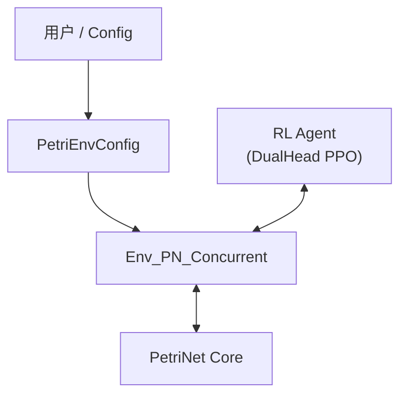
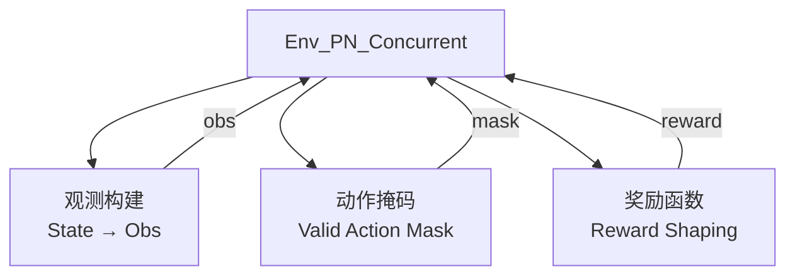
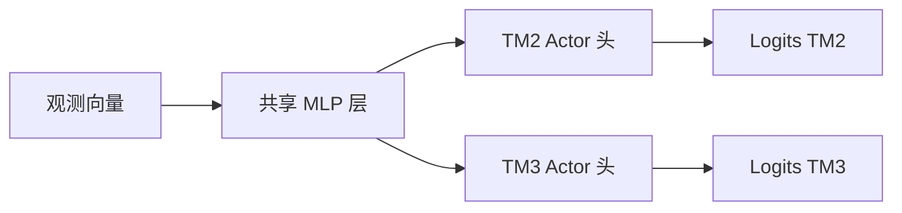
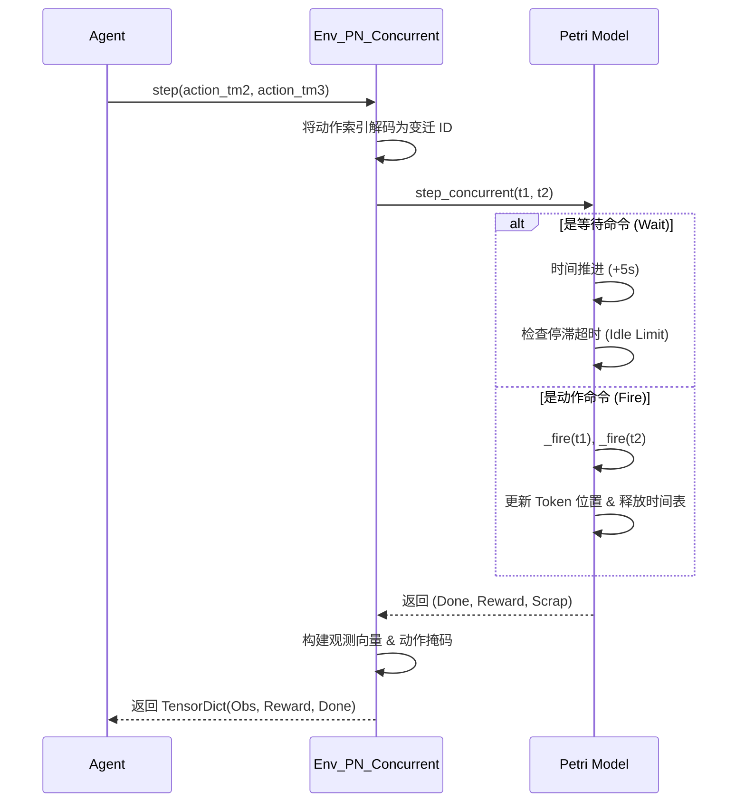
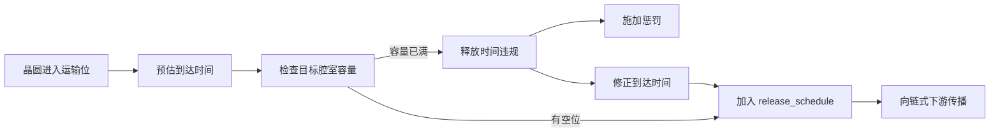

# 连续时间 Petri 网 PPO 调度方案设计文档

本文档详细介绍了基于近端策略优化（PPO）训练的连续时间 Petri 网调度系统的设计、架构及实现细节。

## 1. 系统概览

### 问题陈述
目标是优化具有双机械手（TM2, TM3）和多个加工腔室的半导体制造集群工具的调度。系统必须处理：
*   **连续时间 (Continuous Time)**：模拟真实的加工时间和运输时间。
*   **复杂约束**：
    *   **驻留时间约束 (Resident Time Constraint)**：晶圆在加工腔室完成后必须在规定时间内取出，否则报废（Scrap）。
    *   **Q-Time 约束**：晶圆在运输过程中（机械手/缓冲区）的总时间受限。
    *   **容量约束**：腔室和缓冲区的容量限制。
*   **双机械手协作**：两个机械手（TM2, TM3）并发运行，存在共享资源和独占资源。
*   **双路线支持**：支持晶圆遵循不同的加工路径（`Route 1` 和 `Route 2`）。

### 架构
该方案遵循标准的强化学习（RL）分层架构：

## 2. 核心仿真层 (`pn.py`)

`Petri` 类实现了系统的底层物理模型和业务逻辑。

### 核心概念
| 组件 | 说明 |
| :--- | :--- |
| **Place (库所)** | 代表资源容器：加工腔室 (`s1`-`s5`)、缓冲区 (`s2`, `s4`)、机械手 (`r_TM2`)、输入/输出 (`LP`)。 |
| **Token ** | 代表晶圆（携带 `token_id`, `route`, `step`）或资源占用状态。 |
| **Transition ** | 代表动作：`u_` (Unload，从腔室取出) 和 `t_` (Load，放入腔室)。 |
| **Release Check ** | `release_schedule` 机制用于追踪腔室未来的可用性，防止死锁和容量违规。 |

### 双路线逻辑
系统支持在 `PetriEnvConfig` 中定义不同的路线：
*   **Route 1**: `LP1 -> s1 -> s2 -> s3 -> s4 -> s5 -> LP_done`
*   **Route 2**: `LP2 -> s1 -> s5 -> LP_done`
*   *实现方式*：Token 携带 `route_type` 属性。变迁逻辑会根据 Token 当前的步骤 (`step`) 和路线类型过滤非法移动。

---

## 3. RL 环境层 (`solutions/PPO/enviroment.py`)

`Env_PN_Concurrent` 类将原始 Petri 网封装为兼容 TorchRL 的环境。

### 观测空间 (Observation Space)
系统状态的简化向量表示 (`_build_obs`)：
*   **结构**：包含 `N` 个晶圆的信息列表（默认为 12 个）。
*   **单晶圆特征**：`(token_id, place_idx, place_type, stay_time, time_to_scrap, color)`
*   **选择逻辑**：优先展示正在加工或运输中的晶圆，不足部分从输入缓冲区 (LP) 补充。

### 动作空间 (Action Space)
定义为双离散动作空间，支持并发控制：
*   **TM2 动作**：11 个离散动作（10 个变迁 + 1 个 WAIT）。
    *   变迁：`u_LP1_s1`, `u_LP2_s1`, `u_s1_s2`, `u_s1_s5`, `u_s4_s5`, `u_s5_LP_done`, `t_s1`, `t_s2`, `t_s5`, `t_LP_done`。
*   **TM3 动作**：5 个离散动作（4 个变迁 + 1 个 WAIT）。
    *   变迁：`u_s2_s3`, `u_s3_s4`, `t_s3`, `t_s4`。

### 奖励结构 (Reward Structure)
在 `pn.py` 的 `calc_reward` 中计算，并在 `Env_PN_Concurrent` 中聚合：
*   `+` **加工奖励**：在加工腔室中停留的时间。
*   `+` **完工奖励**：单片完工 (`R_done`) 和全部完工 (`R_finish`) 奖励。
*   `-` **报废惩罚**：发生驻留时间违规时的剧烈惩罚。
*   `-` **时间成本**：每一步的固定惩罚，鼓励快速完成。
*   `-` **拥堵/运输惩罚**：防止系统死锁或运输超时。

---

## 4. 训练系统 (`solutions/PPO/train_concurrent.py`)

使用 `torchrl` 实现 PPO 训练循环。

### 网络架构 (`DualHeadPolicyNet`)
采用共享骨干网络 (Backbone) 加双头的架构：

### 训练循环
1.  **数据收集 (Collection)**：使用当前策略运行环境，`collect_rollout` 利用 `action_mask` 屏蔽非法动作。
2.  **GAE 计算**：计算广义优势估计 (Generalized Advantage Estimation)。
3.  **PPO 更新**：使用截断代理目标函数 (Clipped Surrogate Objective) 优化策略，处理双机械手动作的联合对数概率。
    *   `Joint LogProb = LogProb(TM2) + LogProb(TM3)`

---

## 5. 配置系统 (`data/petri_configs/env_config.py`)

`PetriEnvConfig` 数据类是系统参数的单一事实来源 (Single Source of Truth)。

*   **系统规格**：`n_wafer` (晶圆数), `c_time`, `max_wafers_in_system` (最大在制品数)。
*   **时间常数**：`T_transport` (运输时间), `T_load` (装载时间), 加工时间（在 `pn.py` 中逻辑定义，部分系数可配）。
*   **安全裕量**：`T_warn` (预警时间), `T_safe` (安全裕量), `P_Residual_time` (驻留容忍时间)。
*   **奖励参数**：用于详细奖励塑形的系数 (`proc_reward`, `scrap` 等)。

---

## 6. 执行流程图

### Step 执行逻辑

### 释放检查数据流 (Release Checking)
这是防止连续流死锁的关键机制。

## 7. 常见问题与排错

| 问题现象 | 可能原因 | 修复建议 |
| :--- | :--- | :--- |
| **掩码错误 / 死锁** | `_build_action_masks` 中的掩码逻辑无效。 | 检查 `pn.py` 的 `get_enable_t` 与环境索引的同步情况。 |
| **奖励过低** | 奖励稀疏或惩罚过于激进。 | 在 `env_config.py` 中调整 `reward_config`。增加 `proc_reward` 或减少 `time_cost`。 |
| **报废率高** | 机械手太慢或系统拥堵。 | 调整 `max_wafers_in_system` 限制新晶圆进入。检查 `P_Residual_time` 是否过短。 |
| **训练坍塌** | 熵 (Entropy) 下降过快。 | 在 `training_config` 中调整 `entropy_start` 或学习率 (LR)。 |
