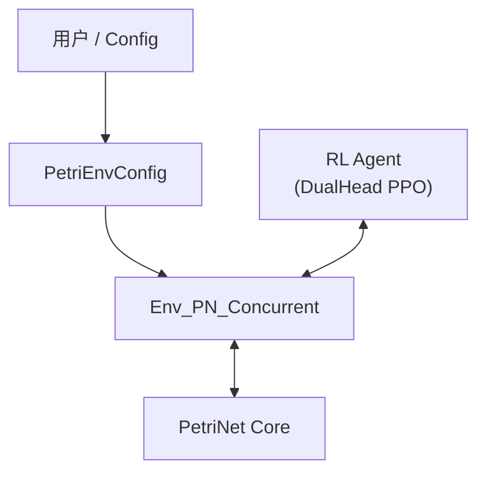
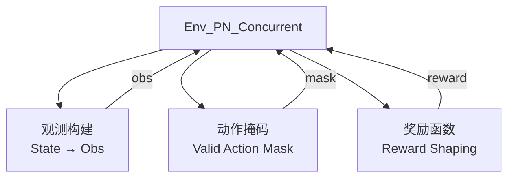
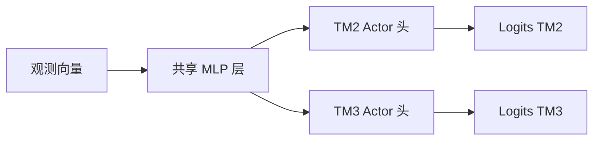
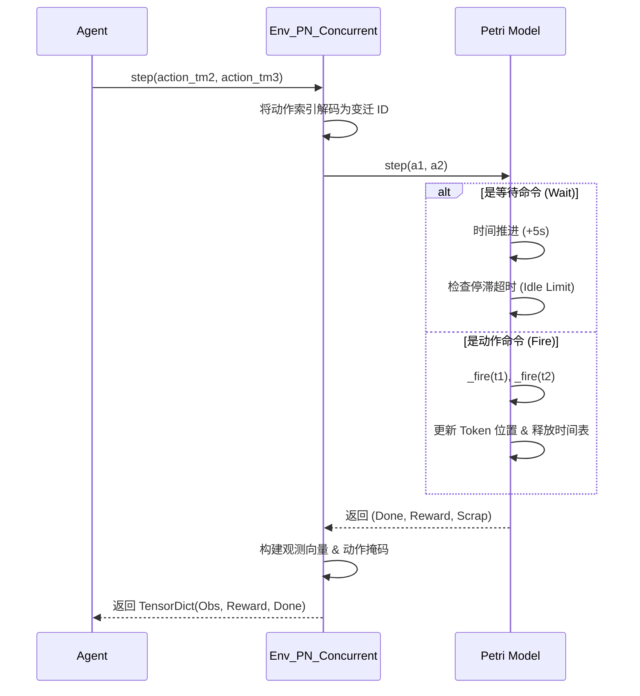
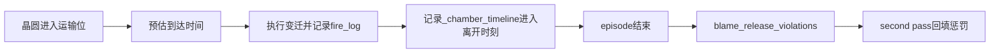

# 连续时间 Petri 网 PPO 调度方案设计文档

本文档详细介绍了基于近端策略优化（PPO）训练的连续时间 Petri 网调度系统的设计、架构及实现细节。

## 1. 系统概览

### 问题陈述
目标是优化具有双机械手（TM2, TM3）和多个加工腔室的半导体制造集群工具的调度。系统必须处理：
*   **连续时间 (Continuous Time)**：模拟真实的加工时间和运输时间。
*   **复杂约束**：
    *   **驻留时间约束 (Resident Time Constraint)**：晶圆在加工腔室完成后必须在规定时间内取出，否则报废（Scrap）。
    *   **Q-Time 约束**：晶圆在运输过程中（机械手/缓冲区）的总时间受限。
    *   **容量约束**：腔室和缓冲区的容量限制。
*   **双机械手协作**：两个机械手（TM2, TM3）并发运行，存在共享资源和独占资源。
*   **双路线支持**：支持晶圆遵循不同的加工路径（`Route 1` 和 `Route 2`）。

### 架构
该方案遵循标准的强化学习（RL）分层架构：


```mermaid
%%{init: {"flowchart": {"curve": "basis"}}}%%
flowchart TB
    User["用户 / Config"]
    Cfg["PetriEnvConfig"]
    Env["Env_PN_Concurrent"]
    Agent["RL Agent<br/>(DualHead PPO)"]
    PN["PetriNet Core"]

    User --> Cfg --> Env
    Agent <--> Env
    Env <--> PN

```


```mermaid
%%{init: {"flowchart": {"curve": "basis"}}}%%
flowchart TB
    Env["Env_PN_Concurrent"]

    Obs["观测构建<br/> State → Obs"]
    Mask["动作掩码<br/>Valid Action Mask"]
    Reward["奖励函数<br/>Reward Shaping"]

    Env --> Obs
    Env --> Mask
    Env --> Reward

    Obs -->|"obs"| Env
    Mask -->|"mask"| Env
    Reward -->|"reward"| Env

```


## 2. 核心仿真层 (`pn.py`)

`Petri` 类实现了系统的底层物理模型和业务逻辑。

### 核心概念
| 组件 | 说明 |
| :--- | :--- |
| **Place (库所)** | 代表资源容器：加工腔室 (`s1`-`s5`)、缓冲区 (`s2`, `s4`)、按机械手分组运输位 (`d_TM2`, `d_TM3`)、输入/输出 (`LP`)。 |
| **Token ** | 代表晶圆（携带 `token_id`, `route`, `step`）或资源占用状态。 |
| **Transition ** | 代表动作：`u_` (Unload，从腔室取出) 和 `t_` (Load，放入腔室)。 |
| **Release Check ** | 基于 `_chamber_timeline` 的事后追责机制用于定位容量违规动作。 |

### 双路线逻辑
系统支持在 `PetriEnvConfig` 中定义不同的路线：
*   **Route 1**: `LP1 -> s1 -> s2 -> s3 -> s4 -> s5 -> LP_done`
*   **Route 2**: `LP2 -> s1 -> s5 -> LP_done`
*   *实现方式*：Token 携带 `route_type` 属性。变迁逻辑会根据 Token 当前的步骤 (`step`) 和路线类型过滤非法移动。

---

## 2.1 单设备扩展（`pn_single.py`）

为避免影响原并发双机械手模型，单设备实现采用独立文件：
- `solutions/Continuous_model/pn_single.py`
- `solutions/Continuous_model/construct_single.py`
- `solutions/Continuous_model/env_single.py`
- `solutions/Continuous_model/train_single.py`（训练入口占位）

### What changed
- 新增单设备 Petri 模型（1 机械手、单动作、8 腔体命名：`LP/LP_done/PM1-6`）。
- 单设备在可视化菜单中可被真实切换，不再仅 UI 占位。
- 单设备 `u-d-t` 子网的卸载命名由 `u_src_dst` 简化为 `u_src`，例如 `u_PM1_PM3/u_PM1_PM4 -> u_PM1`。
- 单设备构网新增 `pre_color(place, transition, color)` 三维前置约束，`color` 由 token 的 `where` 驱动。
- **路由元数据由路径解析生成**：`construct_single.py` 中的 `parse_route(stages, buffer_names)` 从路线阶段序列（如 `[["PM1"], ["PM3","PM4"], ["PM6"]]`）解析出 `chambers`、`step_map`、`u_targets`、`release_station_aliases`、`system_entry_places`、`release_chain_by_u`、`timeline_chambers`，`ClusterTool` 不再维护硬编码分支。

### Why
- 需要在不破坏现有 `pn.py`/并发训练流程的前提下，快速试验单设备工艺。
- 对并行目标机台场景，多个 `t_dst` 共享单一 `u_src` 可减少动作空间冗余并降低策略学习难度。

### Behavior
- 单设备新增设备模板参数：`single_device_mode`（`single` / `cascade`）。
  - `single`：保留原单设备路径逻辑（`single_route_code=0/1`）。
  - `cascade`：改为级联模板路径（可按 `single_route_code` 在多条级联工艺间切换），但仍由 `pn_single + env_single` 承载。
- 单设备新增路径代号参数：`single_route_code`（整数切换预置路径）。
  - `0`（single 模式）：`LP -> PM1(100s) -> [PM3|PM4](300s) -> LP_done`（默认，兼容旧行为）
  - `1`（single 模式）：`LP -> PM1(100s) -> [PM3|PM4](300s) -> PM6(300s) -> LP_done`
  - `1`（cascade 模式，兼容旧模板）：`LP -> PM7/PM8(70s) -> LLC(0s) -> PM1/PM2/PM3/PM4(600s) -> LLD(70s) -> PM9/PM10(200s) -> LP_done`
  - `2`（cascade 模式，新增模板）：`LP -> PM7/PM8(70s) -> LLC(0s) -> PM1/PM2(300s) -> LLD(70s) -> PM9/PM10(200s) -> LP_done`
  - `3`（cascade 模式，新增模板）：`LP -> PM7/PM8(70s) -> LLC(0s) -> PM1/PM2(300s) -> LLD(70s) -> LP_done`
- 单设备工序时长支持配置：`single_process_time_map = {PM1, PM3, PM4, PM6}`；输入值会先预处理为最接近的 5 的倍数（最小 5）。
- 单设备训练支持 episode 级工序时长随机扰动：`proc_rand_enabled` + `single_proc_time_rand_scale_map`（`PM1/PM3/PM4/PM6` 各自 `min/max`）；每个 episode 采样一次并固定整局生效。未配置腔室时使用 `(1.0, 1.0)` 即不扰动。
- `PM2` 仅用于界面占位展示；`PM5` 作为 UI 占位显示，不参与模型工艺流转。`PM6` 是否参与流转由 `single_route_code` 决定。
- 执行链：`construct_single` 构网 -> `_get_enable_t` -> `step` -> `calc_reward`
- 使能动作接口：`List[int]`（单机械手语义）
- 释放追责：支持 `blame_release_violations()`，利用单设备 `_chamber_timeline` 做 second-pass 回填
- 释放追责站点按路径代号聚合：`s1=PM1`，`s2=PM3∪PM4`；当 `single_route_code=1` 时新增 `s3=PM6`，`u_LP` 链路检查扩展为 `s1->s2->s3`。
- `u_src` 发射前会检查“至少一个候选目标可接收”，并在发射时确定 `_target_place`。
- `single` 模式下当 `u_PM1` 目标层为并行 `PM3/PM4` 且两者均可接收时，采用轮换分配（round-robin），避免长期偏置到单一腔室。
- `t_*` 使能在 `d_TM1` 侧额外受 `pre_color[:,:,where]` 限制：只有当前 `where` 对应颜色截面允许的目标才可放行。
- 每次晶圆被变迁移动后执行 `where += 1`，用于推进 color 截面判定。
- 双臂模式下（`single_robot_capacity=2`），只要 `d_TM1` 队首有晶圆，后续 `u_*` 仅允许来自该队首晶圆 `dst` 层的来源；不再依赖“dst 层是否已满”触发。
- 单设备清洗（训练简化版）默认仅作用于 `PM3/PM4`：单腔累计处理 2 片后进入 150s 清洗态；清洗期间目标 `t_*` 在 Stage2 禁用（不参与 Stage1 死锁判定），并记录 `fire_log` 清洗事件（`cleaning_start/cleaning_end`）。
- 单设备 `u_LP` 不再使用 Stage2 反推边界拦截，改为仅遵循通用使能条件（加工完成、目标可达、清洗过滤与运输位停留约束）。该变更用于减少特例裁剪，统一单设备动作语义。
- **wait 截断与关键事件**：长 wait 会被最近的关键事件截断（`actual_dt = min(requested_wait, next_event_delta)`）。关键事件除「某加工完成」外，还包括 **u_LP 到达节拍**（下一次允许 u_LP 发片的时刻）；长 wait 会在上述最近关键事件处截断，以便在节拍点重新决策是否发片。
- 单设备观测向量更新为 float32，并按“合法 `(place_idx, where)` 对全集 one-hot”编码位置（静态规则枚举，不是 `P×W` 笛卡尔积）。单片晶圆特征改为 `present + one_hot(valid_pair_idx) + status_one_hot + remaining_processing_norm + time_to_scrap_norm`：`status_one_hot` 顺序为 `processing/done_waiting_pick/moving/waiting`；其中 `waiting` 定义为“位于运输位且 `stay_time > D_Residual_time`”。`remaining_processing_norm` 用剩余加工量归一化（`0` 表示可取）；`time_to_scrap_norm` 先按阈值 30 裁剪再归一化，且运输位晶圆固定为 `1`。不足 `MAX_WAFERS` 时按单片特征长度补零；末尾追加 9 维清洗状态特征（`PM1/PM3/PM4` 各 `is_cleaning + clean_remaining_time_norm + remaining_runs_before_clean_norm`），不再追加腔室处理计数。
- 单设备奖励已对齐并发模型运输位规则：`d_TM1`（type=2）中晶圆停留超过 `D_Residual_time` 后按超时时长施加线性惩罚（开关：`reward_config.transport_penalty`，系数：`transport_overtime_coef`）。
- 单设备新增独立 `_check_qtime_violation` 检测：在时间推进后检查运输位（type=2）是否 `stay_time > D_Residual_time`；仅用于统计 `qtime_violation_count`（同一 wafer 仅首次违规计数 1 次），不新增 reward 惩罚项。

### 训练模式与评估模式

- **训练模式**（`net.train()` / `Env_PN_Single(eval_mode=False)`）：常规 step 流程，无额外开销。
- **评估模式**（`net.eval()` / `Env_PN_Single(eval_mode=True)`）：
  - 每步调用 `get_enable_actions_with_reasons()`，返回使能动作列表及不使能动作及原因；
  - 结果保存在 `env._last_action_enable_info`，供 `export_inference_sequence` 等读取；
  - 导出时写入 `results/` 目录：`eval_action_enable_<device>_<timestamp>.json`（机器解析）和 `eval_action_enable_<device>_<timestamp>.md`（人工阅读）；
  - Markdown 报告含摘要、原因说明、每步使能/不使能（按原因分组、中文描述）。
- **原因码**：`pn_single.REASON_DESC` 维护英文 reason 到中文描述的映射（如 `process_not_ready` -> 腔室加工未完成）。

### Impact
- 设备模式统一为 `--device single/cascade`，可视化 `cascade` 不再依赖 `pn.py`，统一走 `pn_single/env_single`。
- 单设备逻辑集中在 `Continuous_model` 新文件中，便于后续独立迭代。
- 单设备训练已支持两阶段：阶段1收集轨迹（step 不施加 release 惩罚），阶段2在开启时可执行 `blame_release_violations` 回填奖励。二次追责由 `--blame` 控制：传入 `--blame` 时在 episode 结束后执行回填；不传则不进行二次追责。
- 训练入口 `train_single.py` 支持：`--proc-time-rand-enabled`（开启后按配置中的随机区间执行）、`--blame`（开启二次追责）。
- 单设备训练权重保存格式与并发训练统一：保存 `policy_module.state_dict()`（不再仅保存 backbone）。
- 单设备动作 ID 与旧版 `u_src_dst` 不再一一对应；历史动作序列与旧策略权重需重训或显式映射迁移。

---

## 3. RL 环境层 (`solutions/Continuous_model/env.py`)

`Env_PN_Concurrent` 类定义在 **`solutions/Continuous_model/env.py`**，将原始 Petri 网封装为兼容 TorchRL 的环境。为保持向后兼容，`solutions/PPO/enviroment` 会 re-export 此类，故现有代码中 `from solutions.PPO.enviroment import Env_PN_Concurrent` 仍可使用；新代码推荐直接使用 `from solutions.Continuous_model.env import Env_PN_Concurrent`。

### 观测空间 (Observation Space)
系统状态的简化向量表示 (`_build_obs`)：
*   **结构**：包含 `N` 个晶圆的信息列表（默认为 12 个）。
*   **单晶圆特征**：`(token_id, place_idx, place_type, stay_time, time_to_scrap, color)`
*   **选择逻辑**：优先展示正在加工或运输中的晶圆，不足部分从输入缓冲区 (LP) 补充。

### 动作空间 (Action Space)
定义为双离散动作空间，支持并发控制：
*   **TM2 动作**：11 个离散动作（10 个变迁 + 1 个 WAIT）。
    *   变迁：`u_LP1_s1`, `u_LP2_s1`, `u_s1_s2`, `u_s1_s5`, `u_s4_s5`, `u_s5_LP_done`, `t_s1`, `t_s2`, `t_s5`, `t_LP_done`。
*   **TM3 动作**：5 个离散动作（4 个变迁 + 1 个 WAIT）。
    *   变迁：`u_s2_s3`, `u_s3_s4`, `t_s3`, `t_s4`。

### 奖励结构 (Reward Structure)
在 `pn.py` 的 `calc_reward` 中计算，并在 `Env_PN_Concurrent` 中聚合：
*   `+` **加工奖励**：在加工腔室中停留的时间。
*   `+` **完工奖励**：单片完工 (`done_event_reward`) 和全部完工 (`finish_event_reward`) 奖励。
*   `-` **报废惩罚**：发生驻留时间违规时的剧烈惩罚。
*   `-` **时间成本**：每一步的固定惩罚，鼓励快速完成。
*   `-` **系统逗留惩罚**：对“已进入系统但未完成”的每片晶圆按时间累积惩罚，抑制在 `s2/s4` 的长时间停留。
*   `-` **拥堵/运输惩罚**：防止系统死锁或运输超时。

---

## 4. 训练系统 (`solutions/Continuous_model/train_concurrent.py`)

使用 `torchrl` 实现 PPO 训练循环。

### 网络架构 (`DualHeadPolicyNet`)
采用共享骨干网络 (Backbone) 加双头的架构：

```mermaid
graph LR
    Input[观测向量] --> Backbone[共享 MLP 层]
    Backbone --> Head1[TM2 Actor 头]
    Backbone --> Head2[TM3 Actor 头]
    Head1 --> Out1[Logits TM2]
    Head2 --> Out2[Logits TM3]
```

### 训练循环
1.  **数据收集 (Collection)**：使用当前策略运行环境，`collect_rollout` 利用 `action_mask` 屏蔽非法动作。
2.  **GAE 计算**：计算广义优势估计 (Generalized Advantage Estimation)。
3.  **PPO 更新**：使用截断代理目标函数 (Clipped Surrogate Objective) 优化策略，处理双机械手动作的联合对数概率。
    *   `Joint LogProb = LogProb(TM2) + LogProb(TM3)`

---

## 5. 配置系统 (`data/petri_configs/env_config.py`)

`PetriEnvConfig` 数据类是系统参数的单一事实来源 (Single Source of Truth)。

*   **系统规格**：`n_wafer` (晶圆数), `time_coef`, `max_wafers_in_system` (最大在制品数)。
*   **时间常数**：`T_transport` (运输时间), `T_load` (装载时间), 加工时间（在 `pn.py` 中逻辑定义，部分系数可配）。
*   **安全裕量**：`T_warn` (预警时间), `T_safe` (安全裕量), `P_Residual_time` (驻留容忍时间)。
*   **奖励参数**：用于详细奖励塑形的系数 (`proc_reward`, `scrap` 等)。

---

## 6. 执行流程图

### Step 执行逻辑

```mermaid
sequenceDiagram
    participant Agent
    participant Env as Env_PN_Concurrent
    participant PN as Petri Model
    
    Agent->>Env: step(action_tm2, action_tm3)
    Env->>Env: 将动作索引解码为变迁 ID
    Env->>PN: step(a1, a2)
    
    alt 是等待命令 (Wait)
        PN->>PN: 时间推进 (+5s)
        PN->>PN: 检查停滞超时 (Idle Limit)
    else 是动作命令 (Fire)
        PN->>PN: _fire(t1), _fire(t2)
        PN->>PN: 更新 Token 位置 & 释放时间表
    end
    
    PN-->>Env: 返回 (Done, Reward, Scrap)
    Env->>Env: 构建观测向量 & 动作掩码
    Env-->>Agent: 返回 TensorDict(Obs, Reward, Done)
```

### 释放追踪与追责数据流 (Release Tracking + Blame)
这是防止连续流死锁并定位违规动作的关键机制。


```mermaid
flowchart LR
    TokenEnter[晶圆进入运输位] --> Estimate[预估到达时间]
    Estimate --> FireLog[执行变迁并记录fire_log]
    
    FireLog --> Timeline[记录_chamber_timeline进入离开时刻]
    Timeline --> EpisodeEnd[episode结束]
    EpisodeEnd --> Blame[blame_release_violations]
    Blame --> Backfill[second pass回填惩罚]
```

## 7. 二次释放惩罚验证脚本（动作序列驱动）

为便于检查 `collect_rollout` 的“二次惩罚回填”逻辑，新增了一个脚本式验证流程：

- 序列文件：`solutions/Continuous_model/action_series/test_release_penalty_sequence.json`
- 验证脚本：`solutions/Continuous_model/check_release_penalty.py`
- 输出目录：`results/`

### 运行方式

```bash
python -m solutions.Continuous_model.check_release_penalty
```

可选参数：

```bash
python -m solutions.Continuous_model.check_release_penalty \
  --sequence solutions/Continuous_model/action_series/wrong_seq.json \
  --results-dir results
```

### 验证逻辑

脚本严格分两阶段执行：

1. 第一阶段：在线执行不做 release 预估与即时扣罚，只记录每步 reward、`fire_log` 与 `_chamber_timeline`；
2. 第二阶段：序列结束后调用 `blame_release_violations()`，将 `fire_log_index -> rollout_step` 映射后的惩罚回填到对应 step reward。

输出 JSON 包含：

- `reward_before_second_pass` / `reward_after_second_pass`
- `blame_raw` 与 `blame_mapped`
- `last_u_LP2_s1_second_pass_penalty` 与 `last_u_LP2_s1_penalized`

可直接用于人工核查“最后一次 `u_LP2_s1` 是否被二次惩罚命中”。

## 8. 并发模型推理序列导出（validation）

为减少手工编写动作序列的成本，新增并发模型推理序列导出脚本：

- 脚本：`solutions/Continuous_model/export_inference_sequence.py`
- 输入：训练好的并发模型（`DualHeadPolicyNet` 权重）
- 输出格式：顶层对象包含 `reward_report`（首项）、`schema_version`、`device_mode`、`sequence`、`replay_env_overrides`。其中 `reward_report` 报告推理全程的惩罚触发情况：
  - `scrap_penalty`：报废惩罚次数及触发步数（`count`, `steps`）
  - `release_penalty`：释放违规惩罚次数及触发步数
  - `idle_timeout_penalty`：闲置惩罚次数及触发步数
- `sequence` 格式：`[{"step": int, "time": int, "actions": [...]}]`

### 运行方式

```bash
python -m solutions.Continuous_model.export_inference_sequence \
  --model solutions/Continuous_model/saved_models/CT_concurrent_phase2_best.pt \
  --max-steps 500 \
  --seed 0 \
  --out-name concurrent_infer_seq \
  --phase 2 \
  --force-overwrite-planb
```

### single 模式重试策略（更新）

- What changed：`single`/`cascade` 导出时，重试策略改为“第 1 次使用确定性 `MODE`，后续重试自动切换为随机采样 `RANDOM`”。
- Why：部分单设备权重在确定性推理下会稳定走向 `scrap` 终止，仅增加 `seed` 但保持 `MODE` 不能有效跳出失败轨迹。
- Impact：当首轮未 `finish` 时，后续重试可探索不同合法动作，显著提高导出可完成序列的概率；首轮成功时行为不变。

### 输出位置

- `solutions/Continuous_model/action_series/concurrent_infer_seq_<timestamp>.json`
- `solutions/Td_petri/planB_sequence.json`
- `results/eval_action_enable_<device>_<timestamp>.json`：评估模式动作使能日志（机器解析）
- `results/eval_action_enable_<device>_<timestamp>.md`：评估模式动作使能日志（人工阅读，含摘要、原因说明、每步详情）

其中 `planB_sequence.json` 可直接被 `visualization/main_window.py` 的 Model B 回放逻辑读取。
单设备模式下，导出 JSON 会附带 `replay_env_overrides`（例如本次 episode 的 `single_process_time_map`），回放前可自动重建环境以保证动作序列与工序时间一致。

## 9. 常见问题与排错

| 问题现象 | 可能原因 | 修复建议 |
| :--- | :--- | :--- |
| **掩码错误 / 死锁** | `_build_action_masks` 中的掩码逻辑无效。 | 检查 `pn.py` 的 `get_enable_t` 与环境索引的同步情况。 |
| **奖励过低** | 奖励稀疏或惩罚过于激进。 | 在 `env_config.py` 中调整 `reward_config`。增加 `proc_reward`、减少 `time_cost`，或下调 `in_system_time_penalty_coef`。 |
| **缓冲区滞留严重** | 缺少在系统内停留约束，或惩罚系数过小。 | 启用 `in_system_time_penalty` 并从 `in_system_time_penalty_coef=0.02` 开始小步调参（`0.03~0.05`）。 |
| **报废率高** | 机械手太慢或系统拥堵。 | 调整 `max_wafers_in_system` 限制新晶圆进入。检查 `P_Residual_time` 是否过短。 |
| **训练坍塌** | 熵 (Entropy) 下降过快。 | 在 `training_config` 中调整 `entropy_start` 或学习率 (LR)。 |

---

## 10. 建模变更记录（2026-03）

### What changed
- 在 `solutions/Continuous_model/construct.py` 中，连续模型构图不再显式创建 `r_TM2/r_TM3` 资源库所；
- `u-d-t` 子结构由 `A + r -> u -> d -> t -> B + r` 调整为 `A -> u -> d_TMx -> t -> B`。

### Why
- 机械手分工已由 TM2/TM3 动作通道与 `RobotSpec.reach` 约束表达，显式资源库所在当前并发环境中不再提供额外判别信息；
- 去除冗余库所有助于减少状态维度与构图复杂度。

### Impact / How to use
- 环境入口与训练接口不变，仍使用 `Env_PN_Concurrent` 的双动作通道；
- 观测中的 `place_idx` 编码会随库所集合变化而变化，旧模型权重不保证与新编码完全一致；
- `check_release_penalty.py` 的既有 `wrong_seq/corr_seq` 在 `n_wafer_route2=0` 配置下首步可能不可执行，验证时需使用与当前配置匹配的动作序列。

---

## 11. 生产线节拍独特循环识别（独立脚本）

### What changed
- 新增独立脚本：`solutions/Continuous_model/takt_cycle_analyzer.py`。
- 脚本提供 `analyze_cycle(stages, max_parts=10000)`，用于串行生产线节拍循环识别，输出：
  - `fast_takt`
  - `peak_slow_takts`
  - `cycle_length`
  - `cycle_takts`

### Why
- 需要按业务口径给出“快节拍 + 峰值慢节拍 + 独特循环序列”，而不是平均节拍。
- 需要把维护触发带来的慢节拍显式建模为工序级周期，再合成为整线节拍。

### How to use / Impact
- 输入 `stages` 支持每道工序参数：`p`（单件加工时间）、`m`（并行机台数）、`q`（维护触发件数，`None` 表示无维护）、`d`（维护时长）。
- 节拍构造规则（当前口径）：
  1. 运输时间统一口径：分析器内部先对每道工序做 `p[i] = p[i] + 20`；
  2. 快节拍：`fast_takt = max_i(p[i] / m[i])`；
  3. 有维护工序（`q[i]` 非空）有 `m[i]` 个慢节拍：先放 `q[i]*m[i]` 个快节拍，再从前往后迭代计算慢节拍：
     `slow = max(fast_takt, (p[i]+d[i]) - sum(前 m[i]-1 个节拍))`；
  4. 工序周期长度：`q[i] * m[i] + m[i]`（无维护工序保持快节拍基线）；
  5. 全线周期长度为各工序周期长度的最小公倍数（LCM），按时间从前往后合并；
  6. 若同位出现来自不同工序的慢节拍冲突，取最大慢节拍所属工序 `i'`，按
     `current = max(fast_takt, (p[i']+d[i']) - sum(前 m[i']-1 个全线节拍))` 重算当前位；
  7. 峰值慢节拍集合为 `cycle_takts` 中严格大于 `fast_takt` 的去重升序值。
- `max_parts` 作为循环长度上限：若 LCM 周期长度大于 `max_parts`，函数抛出异常。
- 口径说明：实现已从“事件仿真+状态签名重复”调整为“工序周期叠加+逐位 max”。
- 示例运行：
  - `python -m solutions.Continuous_model.takt_cycle_analyzer`

### 单设备 u_LP 节拍发片限制（pn_single 集成）
- **What**：单设备 `ClusterTool` 在初始化与每次 `reset` 时根据当前加工配方（路线、工序时长、清洗参数）调用 `analyze_cycle`，将得到的 `cycle_takts` 用于限制从 LP 的发片节奏。
- **工序时长**：`_compute_takt_result()` 传入工序原始处理时间 `p`，运输时间常量 `20` 由 `takt_cycle_analyzer.analyze_cycle` 统一计入。
- **级联配置样式统一**：`cascade.json` 已与 `single.json` 对齐为 `chambers` 集成块风格；每个腔室在 `chambers.<name>` 下统一配置 `process_time / cleaning_duration / cleaning_trigger_wafers / proc_rand_scale`，由 `PetriEnvConfig` 归一化为 `process_time_map` 与 `cleaning_*_map`。
- **规则**：仅当“距上次 u_LP 发射的时间”不小于当前周期内对应位置的节拍值时，才允许再次发射 u_LP；首片不受限。
- **取位偏移**：当首片已发射后，第一次进入节拍限制时从循环第 2 个元素开始取值（即跳过第 1 个元素）。
- **实现**：`_compute_takt_result()` 根据 `_route_stages`、`_episode_proc_time_map`、`cleaning_targets` 与 per-chamber 的 `_cleaning_trigger_map`/`_cleaning_duration_map` 构建分析用 stages（p 为原始工序时长）；并行 stage 的 `p` 采用该层瓶颈值（`max`），`q/d` 取该层最可能形成慢节拍的腔室（按 `p+d` 最大）后调用 `takt_cycle_analyzer.analyze_cycle`；`get_enable_t` / `get_enable_actions_with_reasons` 在 u_LP 使能判断中增加节拍间隔检查；原因码 `takt_release_limit` 表示因节拍限制未使能。腔室级清洁与工序参数可由配置中的 `chambers` 集成块提供（见 pn_api.md）。
- **影响**：若节拍分析失败或无可分析工序（如全为缓冲站），`_takt_result` 为 None，不施加发片限制。
