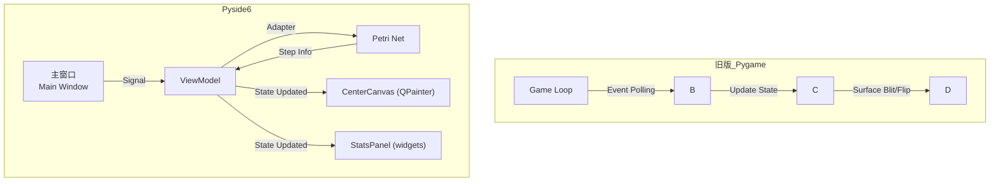
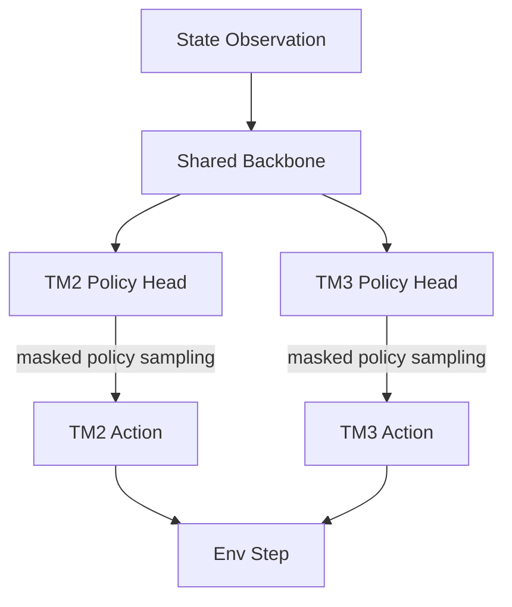

## 1. 可视化界面重构: Pygame $\rightarrow$ Pyside6

**目标**: 用现代化的桌面应用框架替代旧版 Pygame 界面，提供更丰富的功能体验。

- **框架迁移**: 迁移至 **PySide6 (Qt)**，充分利用其高级 UI 组件、硬件加速和事件驱动架构。

## 2. JSON 调度数据读取

**目标**: 支持加载和回放其它算法生成的调度序列，便于分析和验证。

- **机制**: 将调度序列解析为`*_sequence.json` 文件，以供可视化界面调用。
- **作用**: 直接可视化生成的调度序列，无需在回放时重新运行繁重的推理逻辑，便于快速验证调度逻辑的正确性；支持其他算法的评估与验证。

## 3. 建模优化: Petri 网 $\rightarrow$ 着色 Petri 网 (CPN)

**目标**: 增强模型能力，以区分和处理不同类型的作业（晶圆路线）。

- **机制**: 统一运输库所，依赖颜色对晶圆去向分流
- **作用**: 支持多作业类型并发调度，以便后续训练泛化模型；减少模型拓扑结构对加工配方的依赖。

## 4. 动作空间优化: 并发控制 (Concurrent Control)

**目标**: 实现双机械手 (TM2/TM3) 的同时动作，提升系统吞吐量。

- **变更**: 从每步输出单个动作 (`a_t`) $\rightarrow$ 每步输出双动作(a_tm2, a_tm3)。

### 5. 路线支持: 双 Job FSP

**目标**: 支持多作业类型的柔性流水车间 (Flexible Flow Shop, FSP) 场景。

| 模型    | makespan | Q-time | 驻留时间约束 |
| :------ | :------- | :----- | ------------ |
| Model A | 12340s   | 5      | 0            |
| Model B | 7979s    | 0      | 0            |

### 任务

- 代码优化
  - [ ] 增加代码可读性
  - [ ] 去掉一些硬编码变量
  - [x] 优化嵌套函数
  - [x] 去掉不使用的代码
    - [x] 删掉不使用的训练参数
- 可视化界面功能
  - [x] 增加单腔设备.
    - [x] 检查奖励
    - [x] 检查训练(主要是时候追责机制)
    - [x] 评估训练效果
  - [x] 可配置晶圆数量
- 优化模型（加速，并且可以得到最优解）
  - [x] 事后追责机制
  - [x] 为每片晶圆增加在逗留惩罚
  - [ ] 2️⃣大气机器手子智能体: 在晶圆制造设备中,分为大气端和真空端.两者通过LLA和LLB连接.真空端的机器人我已经训练好了,是当前的continuous_model下的模型.我想要设计一个大气端机器手智能体的任务比较简单,将LP的晶圆送到AL,然后从AL送到LLA,将LLB处理好的晶圆送到LP_done.原来为了简化模型,将LLA和LLB分别作为真空端的起始点,命名为了LP和LP_done. 训练这个大气机器手智能体的时候不需要配合真空智能体使用,只需要将LLA的晶圆经过一个随机的时间后移动到LLB即可. 不同的腔体中用泊松分布生成到来的晶圆
  - [ ] 3️⃣先使用PDR生成初始解，然后让模型先模仿初始解的行为
  - [ ] 跨步策略（前期做跨步，后期细微调整。跨步的前提是跨步之后不能导致scrap，否则wait 5s）
  - [ ] 单位时间内产能
- 增加物理约束
  - [ ] 建模分开腔体而不是用并行腔体（用一个分支进行了尝试，结果收敛不了了。暂时没有分析原因）
  - [ ] 处理两个机械臂并发时在buffer处产生冲突的问题
  - [ ] 1️⃣双臂
  - [ ] 清洗
  - [ ] 重入
  - [ ] 旋转
- 模型训练加速
  - [ ] 找出瓶颈
  - [ ] 更换显卡
  - [ ] 优化强化学习模型
- 泛化

