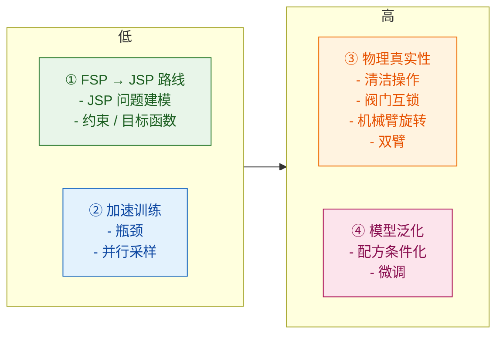

# Project Context

## Purpose
本项目专注于组合设备（Cluster Tool, CT）的调度优化问题。主要目标包括：

- **调度优化**：使用多种算法（强化学习、启发式搜索）优化晶圆加工流程，最小化完工时间（makespan）
- **Petri 网建模**：使用 Petri 网对组合设备进行形式化建模，支持时间约束、资源约束和死锁分析
- **死锁控制**：识别和避免调度过程中的死锁状态，确保调度方案的可行性
- **算法对比**：实现并对比多种调度算法（PPO 强化学习、PDR 搜索、DFS 搜索等）

## Tech Stack
- **Python 3.11** - 主要编程语言
- **PyTorch** - 深度学习框架，用于神经网络实现
- **TorchRL** - 强化学习库，提供 PPO 算法、环境封装、数据收集等功能
- **NumPy** - 数值计算
- **Pandas** - 数据处理和 CSV 文件操作
- **标准库**：`dataclasses`, `typing`, `heapq`, `collections` 等

## Project Conventions

### Code Style
- **命名约定**：使用 snake_case 命名函数和变量，PascalCase 命名类
- **类型提示**：使用 `typing` 模块提供类型注解（如 `List[int]`, `Dict[str, float]`, `Optional[Tuple]`）
- **文档字符串**：使用 docstring 描述类和方法的功能
- **代码组织**：按功能模块组织代码，每个模块有清晰的职责划分

### Architecture Patterns
- **模块化设计**：代码按功能分为多个解决方案模块：
  - `solutions/PPO/` - 基于 PPO 的强化学习调度
  - `solutions/PDR/` - 基于 Timed Place Transition Petri Net 的Priority Dispatch Rules搜索算法
  - `solutions/DFS/` - 深度优先搜索算法
  - `solutions/Td_petri/` - 基于Timed Transition Petri Net的RL搜索算法
  - `solutions/model/` - Petri 网基础模型和控制器
- **环境封装**：使用 TorchRL 的 `EnvBase` 封装调度环境，提供标准的 `reset()` 和 `step()` 接口
- **配置分离**：调度参数通过配置文件（`data/config/params_N*.py`）管理，支持不同规模的测试案例
- **数据驱动**：使用 TOML 文件（`data/DFS_data/*.toml`）定义任务配置

### Testing Strategy
- 项目包含部分测试文件（`solutions/v2/test.py`, `solutions/DFS/test.py`），但测试覆盖不完整
- 主要通过运行脚本（`run_ppo.py`, `run_pdr.py`）进行功能验证
- 使用验证脚本（`solutions/PPO/validation.py`）评估训练模型的性能
- **建议**：未来应增加单元测试和集成测试，特别是对 Petri 网状态转换和死锁检测的测试

### Git Workflow
- 当前未明确文档化的 Git 工作流
- **建议**：使用功能分支开发，主分支保持稳定

## Domain Context
### 组合设备（Cluster Tool）
- 用于半导体制造中的晶圆加工设备
- 包含多个处理模块（PM）、缓冲模块（BM）、机械手（Robot Arm）等组件
- 晶圆需要按照特定路径（route）经过多个工序完成加工

### Petri 网建模
- 使用 Petri 网对组合设备进行形式化建模
- **库所（Place）**：表示资源状态（如机器空闲、晶圆位置）
- **变迁（Transition）**：表示动作（如机械手移动、晶圆加工）
- **标识（Marking）**：表示系统状态，通过 token 分布描述
- **时间 Petri 网**：扩展标准 Petri 网，支持时间约束和驻留时间

### 调度问题
- **目标**：最小化完工时间（makespan），即所有晶圆完成加工的总时间
- **约束**：
  - 资源容量约束（每个处理模块同时只能处理有限数量的晶圆）
  - 时间窗口约束（晶圆在工序间转移有时间窗口限制）
  - 死锁避免（避免系统进入无法继续执行的状态）
- **动作空间**：选择可发射的变迁（transition），每个变迁对应一个调度动作

### 强化学习
- 将调度问题建模为马尔可夫决策过程（MDP）
- **状态**：Petri 网的当前标识（marking）
- **动作**：选择下一个要发射的变迁
- **奖励**：负的时间增量（鼓励快速完成）和死锁惩罚（避免死锁）
- **算法**：使用 PPO（Proximal Policy Optimization）进行策略学习

### 死锁控制
- **坏标识（Bad Marking）**：会导致死锁的标识
- **死标识（Dead Marking）**：无法继续执行的标识
- 使用控制器（Controller）限制资源分配，防止死锁
- 研究零缓冲窗口控制器（ZeroBufferWindowController）等控制策略


### 延迟机制

- **驻留时间冲突（Conflict 1）**：
  
  - **现象**：并行机器导致下游单机工序产生阻塞，触发驻留时间违规。
  - **对策**：引入"主动延迟"
  
  ```mermaid
  flowchart LR
      A[LP] --> PM1[PM1<br/>proc=30s]
  
      PM1 --> PM2[PM2<br/>proc=80s]
      PM2 --> DONE[LP_done]
  
      %% ===== Risk annotation around PM1 =====
      subgraph RISK1["⚠ 过早开工造成堵塞风险"]
          direction TB
          PM1
      end
  
     
  
      %% ===== Styles =====
      classDef normal fill:#ffffff,stroke:#8b8b8b,stroke-width:1px;
      classDef term fill:#f7fff7,stroke:#3cb371,stroke-width:1px;
      classDef risk fill:#fff4f4,stroke:#ff6b6b,stroke-width:1.5px;
  
      class PM2,d_PM2 normal;
      class PM1 risk
      class A,DONE term;
  
      style RISK1 fill:#fff7e6,stroke:#f0b429,stroke-width:1.2px,rx:6,ry:6;
  ```
  
  
  
  ```mermaid
  flowchart LR
    %% ===== Nodes =====
    LP[LP] --> PM1[PM1<br/>proc=50s]
    LP --> PM2[PM2<br/>proc=50s]
  
    PM1 --> PM3[PM3<br/>proc=50s]
    PM2 --> PM3
  
  
    PM3 --> LP_done[LP_done]
  
  
    %% ===== Risk Area =====
    subgraph RISK["⚠ 同时开工 → 在 PM3 堵塞"]
      direction TB
      PM1
      PM2
    end
  
    %% ===== Styles =====
    classDef normal fill:#ffffff,stroke:#8b8b8b,stroke-width:1px;
    classDef merge fill:#f6f6ff,stroke:#6b6bd6,stroke-width:1px;
    classDef risk fill:#fff4f4,stroke:#ff6b6b,stroke-width:1.5px;
    classDef term fill:#f7fff7,stroke:#3cb371,stroke-width:1px;
  
  
    class PM1,PM2 risk;
    class PM3,d_PM3 normal;
    class LP,LP_done term
  
    style RISK fill:#fff7e6,stroke:#f0b429,stroke-width:1.5px,rx:6,ry:6;
  
  ```
  
  ```mermaid
  sequenceDiagram
      participant LP
      participant d_PM1
      participant PM1
      participant PM2
  
      Note over LP,PM2: 晶圆1 (id=1) 执行 u_LP_PM1
      LP->>d_PM1: 晶圆1 进入 d_PM1 (enter=10)
      d_PM1->>PM1: 记录 (1, 10+5+5+80=100)
      PM1->>PM2: 链式记录 (1, 100+15+50=165)
  
      Note over LP,PM2: 晶圆1 在 d_PM1 等待到 t=20
  
      Note over LP,PM2: 晶圆1 执行 t_PM1 (实际进入 PM1)
      d_PM1->>PM1: 更新 (1, 20+5+80=105)
      PM1->>PM2: 链式更新 (1, 105+15+50=170)
  
      Note over LP,PM2: 晶圆2 (id=2) 执行 u_LP_PM1
      LP->>d_PM1: 晶圆2 进入 d_PM1 (enter=25)
      d_PM1->>PM1: 检查: 25+5+5=35 vs PM1 最早释放 105
      Note right of PM1: 35 < 105, 但 PM1 cap=2, 检查队列长度
      d_PM1->>PM1: 记录 (2, 35+80=115)
      PM1->>PM2: 检查: 115+15=130 vs PM2 释放 170
      Note right of PM2: 130 < 170, PM2 cap=1, 触发违规惩罚!
  ```
  
  
  
- **链式时间依赖（Conflict 2）**：
  
  - **现象**：前道工序的启动时刻依赖于后道工序的释放时刻（FFSJ 特性）。
  - **对策**：只有确定了下游工序的结束时间，才能回推上游工序的最优启动点。

### 两阶段课程学习训练

为降低强化学习的难度，采用两阶段课程学习（Curriculum Learning）策略：

**阶段划分：**
| 阶段 | `training_phase` | 奖励结构 | 目标 |
|------|-----------------|---------|------|
| Phase 1 | 1 | `R_scrap` + `overtime_penalty` | 学习避免晶圆报废（加工腔室超时） |
| Phase 2 | 2 | Phase 1 + `transport_penalty` | 在避免报废的基础上，学习优化运输位停留时间 |

**奖励组件说明：**
- `R_scrap`：晶圆报废惩罚（超过 `proc_time + P_Residual_time` 后触发）
- `overtime_penalty`：加工腔室超时惩罚（逐秒递增）
- `transport_penalty`：运输位超时惩罚（超过 `D_Residual_time` 后逐秒递增）

**使用方式：**
```bash
# Phase 1: 仅报废惩罚
python -m solutions.PPO.run_ppo --phase 1

# Phase 2: 加载 Phase 1 checkpoint 继续训练
python -m solutions.PPO.run_ppo --phase 2

# 自动两阶段训练（先 Phase 1，再 Phase 2）
python -m solutions.PPO.run_ppo --auto-phase2
```

**checkpoint 文件位置：**
- Phase 1 模型：`solutions/PPO/saved_models/CT_phase1_latest.pt`
- Phase 2 模型：`solutions/PPO/saved_models/CT_phase2_latest.pt`

## Important Constraints
- **计算资源**：强化学习训练需要较长计算时间，建议使用 GPU 加速
- **状态空间**：Petri 网的状态空间可能非常大，需要有效的状态表示和动作掩码
- **死锁处理**：必须避免死锁，死锁惩罚需要足够大（通常大于最短完工时间）
- **时间精度**：调度时间使用整数表示，运输时间（tau）和处理时间（proc_time）为整数
- **兼容性**：代码需要兼容不同规模的 Petri 网（N2-N8 等不同配置）

## External Dependencies
- **PyTorch** - 深度学习框架，需要 CUDA 支持以使用 GPU 训练
- **TorchRL** - 强化学习库，提供环境、算法和数据收集功能
- **NumPy/Pandas** - 数据处理，用于 Petri 网矩阵操作和结果记录
- **Pygame** - 游戏开发库，用于 Petri 网动画可视化
- **配置文件** - 项目依赖多个参数配置文件（`data/config/params_N*.py`）
- **数据文件** - 需要 Petri 网定义文件（`.ndr`, `.npz`）和任务配置（`.toml`）
- **可视化工具** - 使用 `visualization/plot.py` 绘制甘特图，可能需要 matplotlib


## TO DO



- ~~检查奖励问题~~
- 路线可配置
- 激进模式和保守模式
- 可视化工具兼容其它调度算法（链式算法/PDR/蚁群/A星和遗传算法）
- 让模型达到最优（增大系统允许晶圆数6）
- FSP to JSP
- 模型加速
- 泛化

