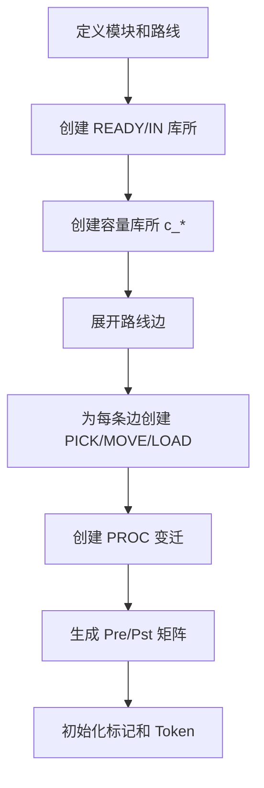
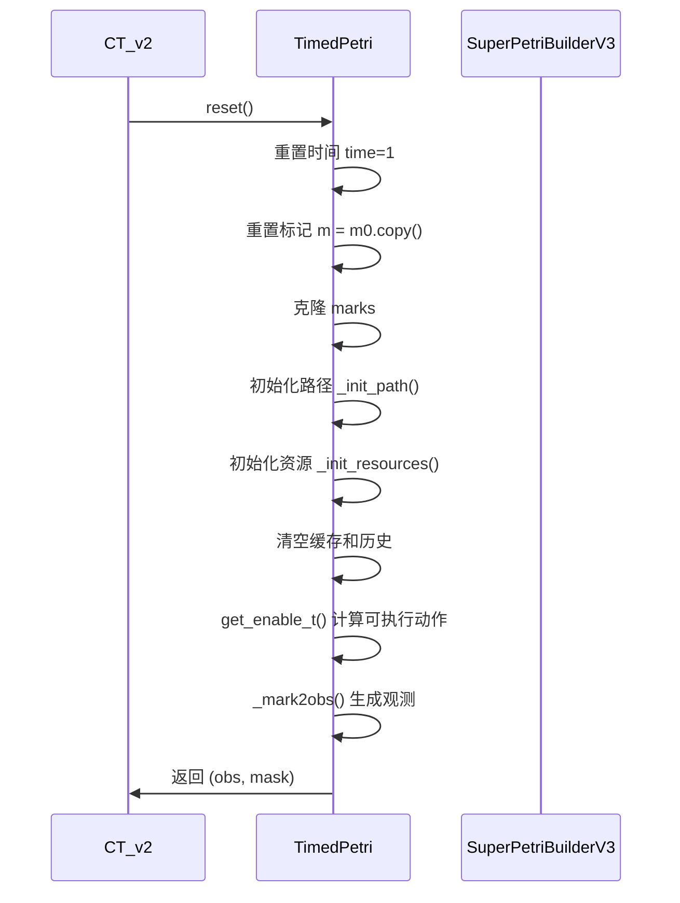
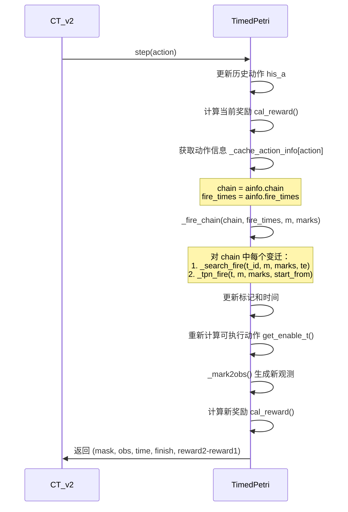

# Td_petri 调度思路文档

## 概述

Td_petri（Timed Discrete Petri Net）是一套基于时间离散 Petri 网的调度系统，采用 chain-based 动作空间和资源占用时间轴管理机制。与连续时间模型不同，Td_petri 将时间离散化，只有变迁（transition）具有时间属性，而库所（place）仅表达状态。

### 核心思想

1. **时间离散化**：只有变迁有时间，place 只表达状态（READY/IN/中间态）
2. **Chain-based 动作**：将多个变迁组合成执行链（chain），动作是选择一条完整的执行路径
3. **资源占用时间轴**：使用时间区间管理资源（机械手、机台）的占用情况
4. **Dry-run 预计算**：在执行动作前预计算执行时间和资源冲突
5. **开放区间管理**：对于加工模块，使用开放区间 `[start, INF)` 直到离开时才关闭

## 架构设计

### Petri 网构建（SuperPetriBuilderV3）

`SuperPetriBuilderV3` 负责构建 Petri 网结构，支持并行路线和模块化设计。

#### 关键概念

- **模块（Module）**：系统中的物理单元（如 PM7、LLC、ARM1 等）
- **路线（Route）**：晶圆从起点到终点的路径，支持并行选择
- **库所类型**：
  - `P_READY__{module}`：模块就绪状态（晶圆已完成加工，可被取出）
  - `P_IN__{module}`：模块输入状态（晶圆刚进入，等待加工）
  - `P_HAND__{arm}__{from}__TO__{to}`：机械手搬运中间态
  - `P_AT__{arm}__{module}`：机械手到达目标位置
  - `c_{module}`：容量库所（控制模块容量）

#### 变迁类型

1. **搬运变迁**：
   - `{ARM}_PICK__{from}__TO__{to}`：拾取（5秒）
   - `{ARM}_MOVE__{from}__TO__{to}`：移动（5秒）
   - `{ARM}_LOAD__{from}__TO__{to}`：放置（5秒）

2. **加工变迁**：
   - `PROC__{module}`：模块加工时间（根据模块类型不同）

#### 构建流程



### 时间管理机制

#### 时间推进

- 系统时间 `self.time` 记录当前全局时间
- 每个变迁执行时，时间推进到 `te + duration`（变迁结束时刻）
- Token 的 `enter_time` 记录进入当前库所的时间

#### 资源占用时间轴（res_occ）

```python
self.res_occ = {
    "ARM1": [Interval(start, end, tok_key, ...), ...],
    "PM7": [Interval(start, end, tok_key, ...), ...],
    ...
}
```

- 每个资源维护一个按 `start` 排序的区间列表
- 区间采用半开区间 `[start, end)`
- 加工模块使用开放区间 `[start, INF_OCC)`，直到离开时才关闭

### 资源占用管理

#### 资源类型

1. **机械手资源**：ARM1、ARM2、ARM3
2. **加工模块资源**：PM7、PM8、PM1-PM4、PM9、PM10、LLC、LLD 等

#### 资源分配

- `_t_resources(t, marks)`：返回变迁 `t` 占用的资源列表
- `_sync_start(res_names, t0, dur)`：同步多个资源，找到最早可插入时间
- `_first_free_time_at(intervals, t, t2)`：在区间列表中找最早可插入点

## 动作空间设计

### Chain-based 动作定义

动作不是单个变迁，而是一条完整的执行链（chain），包含多个连续的变迁。

#### 路线定义

系统支持两条路线：

**路线 C（完整路线）**：
```
LP1 → AL → LLA_S2 → [PM7/PM8] → LLC → [PM1/PM2/PM3/PM4] → LLD → [PM9/PM10] → LLB_S1 → LP_done
```

**路线 D（简化路线）**：
```
LP2 → AL → LLA_S2 → [PM7/PM8] → [PM9/PM10] → LLB_S1 → LP_done
```

#### Chain 构建

每个 chain 对应路线中的一个阶段（stage），并行阶段包含多个可选 chain：

```python
pathC = [
    [['ARM1_PICK__LP1__TO__AL', 'ARM1_MOVE__LP1__TO__AL', ...]],  # Stage 0: LP1→AL
    [['ARM1_PICK__AL__TO__LLA_S2', ...]],  # Stage 1: AL→LLA
    [
        ['ARM2_PICK__LLA_S2__TO__PM7', ..., 'ARM2_PICK__PM7__TO__LLC', ...],  # Chain 0
        ['ARM2_PICK__LLA_S2__TO__PM8', ..., 'ARM2_PICK__PM8__TO__LLC', ...],  # Chain 1
    ],  # Stage 2: 并行选择 PM7/PM8
    ...
]
```

#### 动作空间映射

- `aid2chain`：动作 ID → chain（变迁名称列表）
- `chain2aid`：chain → 动作 ID
- `aid_is_parallel`：标记动作是否属于并行阶段
- `aid_pstage`：并行阶段 ID（-1 表示非并行）

### 动作掩码生成

```python
def get_enable_t(self, m, mark):
    # 1. 结构使能检查
    se = self._resource_enable(m)  # 基于 Pre 矩阵
    
    # 2. 颜色使能检查（根据 wafer 路径）
    se_chain = self._color_enable(se, mark)
    
    # 3. Dry-run 检查（资源冲突）
    transition_queue = []
    for t, chain in se_chain:
        ok, times, end_time, _, _ = self._dry_run_chain(chain_names=chain, m=m, marks=mark)
        if ok:
            transition_queue.append((t, key_time, name, chain, times))
    
    return transition_queue
```

## 观测空间设计

### 观测向量组成

观测维度：`obs_dim = 2 * len(obs_place_idx) + his_len`

#### P_READY 状态（32维）

- `obs1[16]`：type=1 的 token 数量（路线 C 的 wafer）
- `obs2[16]`：type=2 的 token 数量（路线 D 的 wafer）
- 遍历所有 `P_READY__*` 库所，统计两类 token

#### 历史动作（50维）

- `his_a[50]`：最近 50 个动作的历史记录
- 每次 step 时，移除最旧的动作，添加新动作

### 观测生成

```python
def _mark2obs(self):
    obs1 = np.zeros(16)  # type=1 token 计数
    obs2 = np.zeros(16)  # type=2 token 计数
    
    for k, idx in enumerate(self.obs_place_idx):
        p = self.marks[idx]
        for tok in p.tokens:
            if tok.type == 1:
                obs1[k] += 1
            elif tok.type == 2:
                obs2[k] += 1
    
    his_a = np.array(self.his_a)  # 历史动作
    obs = np.concatenate([obs1, obs2, his_a])
    return obs
```

## 执行流程

### Reset 流程



### Step 流程（Dry-run → Fire Chain）



#### Dry-run 机制

在执行动作前，通过 `_dry_run_chain` 预计算：

1. **结构检查**：验证变迁序列的结构可行性
2. **资源检查**：检查资源占用时间轴，计算最早可执行时间
3. **时间计算**：返回每个变迁的执行时间 `times`

```python
def _dry_run_chain(self, chain_names, m, marks, max_retry=200):
    # 1. 结构预检查
    tmp_m = m.copy()
    for t_id in t_ids:
        if not _struct_enable_single(t_id, tmp_m):
            return False, [], -1, None, None
        tmp_m = _struct_fire(tmp_m, t_id)
    
    # 2. 分段资源检查（ARM/PROC 块）
    blocks = split_blocks(chain_names)
    for retry in range(max_retry):
        cur_t = base_start + shift0
        ok = True
        for typ, block in blocks:
            dur = block_dur[id(block)]
            if typ == "ARM":
                # 检查机械手资源
                t_free = _first_free_time_at(arm_occ, cur_t, cur_t + dur)
            else:
                # 检查加工模块资源（最后一个用开放区间）
                if is_last_proc:
                    t_free = _first_free_time_open(proc_occ, cur_t)
                else:
                    t_free = _first_free_time_at(proc_occ, cur_t, cur_t + dur)
            
            if t_free != cur_t:
                ok = False
                shift0 += max(1, t_free - cur_t)
                break
            cur_t += dur
        
        if ok:
            return True, times, cur_t, None, None
    
    return False, [], -1, None, None
```

#### Fire Chain 执行

```python
def _fire_chain(self, chain_names, times, m, marks):
    # 1. 删除 wafer 已发射的链（更新路径）
    t0_id = t_ids[0]
    for p in t0_pre:
        if isinstance(marks[p].head(), WaferToken):
            tok = marks[p].head()
            tok.path.pop(0)  # 移除已执行的阶段
            tok.where += 1   # 更新位置索引
    
    # 2. 按 times 严格执行每个变迁
    for i, t_id in enumerate(t_ids):
        te = int(times[i])  # 使用 dry-run 给出的时间
        info = self._search_fire(t_id, cur_m, cur_marks, te)
        cur_m, cur_marks, cur_time = info["m"], info["marks"], info["time"]
    
    return {"m": cur_m, "marks": cur_marks, "time": cur_time, ...}
```

## 奖励机制

### 奖励计算

```python
def cal_reward(self, mark):
    work_finish = 0
    xx = [0, 10, 30, 100, 770, 970, 1000]  # 阶段奖励权重
    
    for p in self.obs_place_idx:
        if p not in self.idle_idx['start']:
            place = mark[p]
            for tok in place.tokens:
                if isinstance(tok, WaferToken):
                    ww = tok.where  # wafer 当前位置
                    if tok.type == 1:
                        return -1  # 路线 C 未完成
                    elif tok.type == 2:
                        work_finish += xx[ww]  # 路线 D 进度奖励
    
    return work_finish / self.time  # 归一化到时间
```

### 环境奖励

在 `CT_v2._step` 中：

```python
delta_time = time - last_time
if delta_time > 0:
    r_time = -1 * delta_time  # 时间惩罚
else:
    r_time = 0

reward = reward1 * 100  # 完成进度奖励（放大100倍）
```

## 与连续模型的区别

### 时间模型

| 特性 | Td_petri | 连续模型 (Env_PN) |
|------|----------|-------------------|
| 时间表示 | 离散整数时间点 | 连续浮点时间 |
| 时间推进 | 变迁执行时推进 | 等待动作推进时间 |
| 时间单位 | 秒（整数） | 秒（浮点） |

### 动作粒度

| 特性 | Td_petri | 连续模型 |
|------|----------|----------|
| 动作类型 | Chain（多个变迁） | 单个变迁或等待 |
| 动作空间 | Chain ID（aid） | 变迁 ID + 等待动作 |
| 执行方式 | 原子执行整个 chain | 单步执行一个变迁 |

### 观测空间

| 特性 | Td_petri | 连续模型 |
|------|----------|----------|
| 观测内容 | P_READY 状态 + 历史动作 | Wafer 六元组信息 |
| 观测维度 | 32 + 50 = 82 | 12 * 6 = 72 |
| 历史信息 | 动作历史（50维） | 无显式历史 |

### 资源管理

| 特性 | Td_petri | 连续模型 |
|------|----------|----------|
| 资源表示 | 时间区间列表 | 实时占用状态 |
| 冲突检测 | Dry-run 预计算 | 实时检查 |
| 开放区间 | 支持（加工模块） | 不支持 |

## 使用方式

### 训练

#### 命令行训练

```bash
# 使用默认配置训练
python solutions/PPO/run_ppo_tdpn.py

# 使用自定义配置文件
python solutions/PPO/run_ppo_tdpn.py --config data/ppo_configs/tdpn_config.json

# 从checkpoint继续训练
python solutions/PPO/run_ppo_tdpn.py --checkpoint saved_models/CT_tdpn_best.pt

# 指定随机种子
python solutions/PPO/run_ppo_tdpn.py --seed 42

# 使用GPU训练
python solutions/PPO/run_ppo_tdpn.py --device cuda

# 组合使用多个参数
python solutions/PPO/run_ppo_tdpn.py --config data/ppo_configs/tdpn_config.json --device cuda --seed 42
```

#### 命令行参数说明

- `--config`: 自定义配置文件路径（可选）。如果不指定，优先使用 `data/ppo_configs/tdpn_config.json`，否则使用 `phase2_config.json`
- `--checkpoint`: checkpoint文件路径（可选），用于继续训练
- `--device`: 计算设备，可选 `cpu` 或 `cuda`。默认自动检测
- `--seed`: 随机种子（可选）

#### Python API 训练

```python
from solutions.PPO.run_ppo_tdpn import train_tdpn

# 训练
log, policy = train_tdpn(
    device='cpu',
    config_path='data/ppo_configs/tdpn_config.json',
    checkpoint_path=None,
    seed=42
)
```

### 验证

#### 命令行验证

```bash
# 验证 CT_v2 (Td_petri) 模型
python solutions/PPO/validation.py --env_type CT_v2 --model_path saved_models/CT_tdpn_latest.pt

# 验证 Env_PN 模型（连续模型，原有功能）
python solutions/PPO/validation.py --env_type Env_PN --model_path saved_models/CT_phase2_latest.pt

# 使用GPU验证
python solutions/PPO/validation.py --env_type CT_v2 --device cuda

# 指定运行次数和最大步数
python solutions/PPO/validation.py --env_type CT_v2 --n_runs 10 --max_steps 2000

# 指定随机种子
python solutions/PPO/validation.py --env_type CT_v2 --seed 42
```

#### 命令行参数说明

- `--model_path`: 模型文件路径（如果不指定，根据 env_type 使用默认路径）
- `--env_type`: 环境类型，可选 `Env_PN`（连续模型）或 `CT_v2`（Td_petri）。默认: `Env_PN`
- `--config`: 使用的配置文件（仅 Env_PN 需要），可选 `N2`, `N5`, `N6`, `N7`, `N8`。默认: `N7`
- `--n_wafer`: 晶圆数量（仅 Env_PN 需要），默认: `75`
- `--device`: 计算设备，可选 `cpu` 或 `cuda`。默认: `cpu`
- `--max_steps`: 最大评估步数，默认: `1500`
- `--n_runs`: 运行次数，默认: `5`
- `--seed`: 随机种子（可选）

#### Python API 验证

```python
from solutions.PPO.validation import load_policy, ev
from solutions.PPO.enviroment import CT_v2
from torchrl.envs import Compose, DTypeCastTransform, TransformedEnv, ActionMask

# 创建环境
base_env = CT_v2(device='cpu', seed=42)
transform = Compose([
    ActionMask(),
    DTypeCastTransform(
        dtype_in=torch.int64,
        dtype_out=torch.float32,
        in_keys="observation",
        out_keys="observation_f"
    ),
])
env = TransformedEnv(base_env, transform)

# 加载模型
policy = load_policy('saved_models/CT_tdpn_best.pt', env, device='cpu')

# 评估
makespan = ev(env, policy, max_steps=1500)
print(f"Makespan: {makespan}")
```

### 基本使用（环境接口）

```python
from solutions.PPO.enviroment import CT_v2
from torchrl.envs import Compose, DTypeCastTransform, TransformedEnv, ActionMask
import torch

# 创建环境
base_env = CT_v2(device='cpu', seed=42)

# 添加变换
transform = Compose([
    ActionMask(),
    DTypeCastTransform(
        dtype_in=torch.int64,
        dtype_out=torch.float32,
        in_keys="observation",
        out_keys="observation_f"
    ),
])
env = TransformedEnv(base_env, transform)

# 重置环境
td = env.reset()
print(f"观测维度: {td['observation'].shape}")
print(f"动作掩码: {td['action_mask'].sum()} 个可用动作")

# 执行动作
td = env.step(td)
print(f"奖励: {td['reward'].item()}")
print(f"完成: {td['finish'].item()}")
print(f"当前时间: {td['time'].item()}")
```

## 关键参数

### TimedPetri 初始化参数

- `modules`：模块定义（tokens、capacity）
- `routes`：路线定义（支持并行选择）

### CT_v2 环境参数

- `device`：计算设备（'cpu' 或 'cuda'）
- `seed`：随机种子

### 观测参数

- `obs_place_idx`：观测库所索引（P_READY__*）
- `his_len`：历史动作长度（默认 50）

### 动作参数

- `A`：动作空间大小（chain 数量）
- `aid2chain`：动作 ID 到 chain 的映射

## 性能优化

1. **动作缓存**：`_cache_action_info` 缓存可执行动作的信息
2. **Dry-run 限制**：`max_retry=200` 限制重试次数
3. **区间排序**：资源占用区间按 start 排序，使用二分查找
4. **并行阶段标记**：`aid_is_parallel` 标记并行动作，避免重复计算

## 注意事项

1. **时间同步**：确保所有资源的时间同步，避免冲突
2. **开放区间关闭**：加工模块的开放区间必须在离开时关闭
3. **路径更新**：执行 chain 后必须更新 wafer 的路径信息
4. **资源释放**：PICK 动作会释放源模块的容量库所 token

## 参考资料

- **核心代码**：`solutions/Td_petri/tdpn.py` (TimedPetri)
- **构建器**：`solutions/Td_petri/construct.py` (SuperPetriBuilderV3)
- **环境封装**：`solutions/PPO/enviroment.py` (CT_v2)
- **训练脚本**：`solutions/PPO/run_ppo_tdpn.py`
- **验证脚本**：`solutions/PPO/validation.py`
