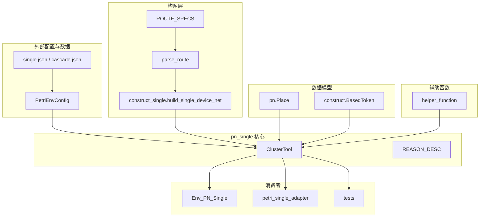
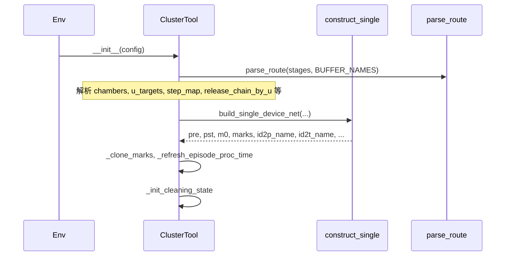
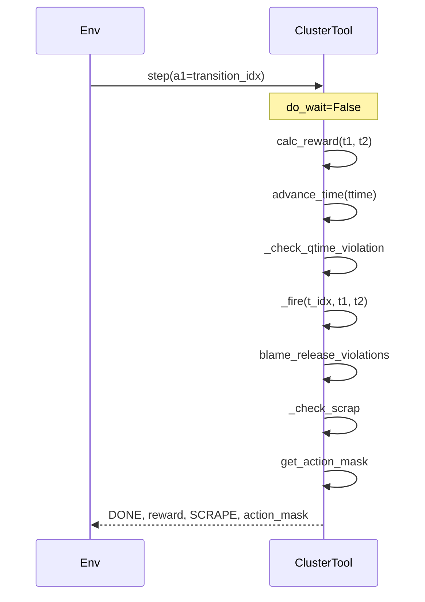
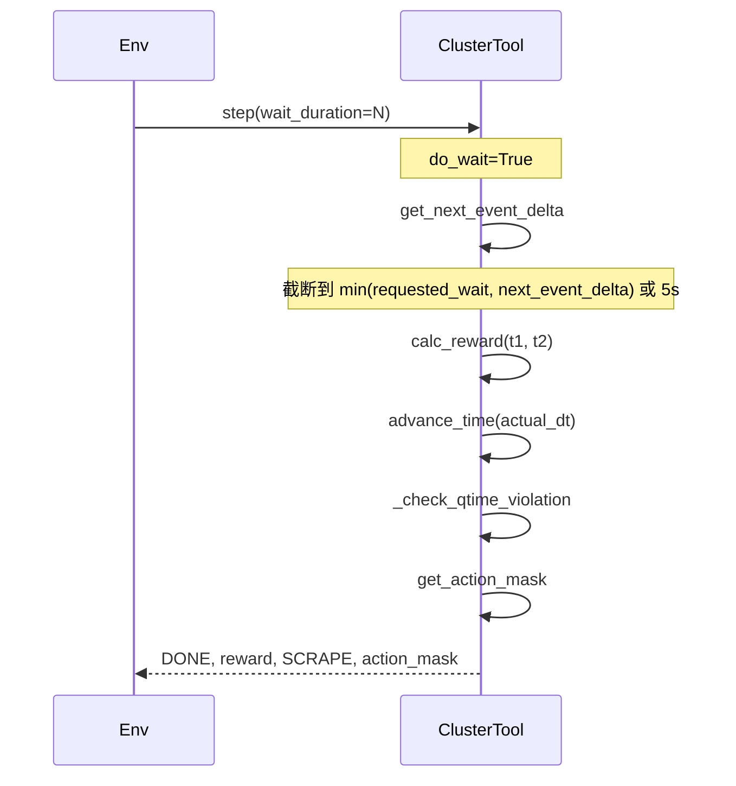
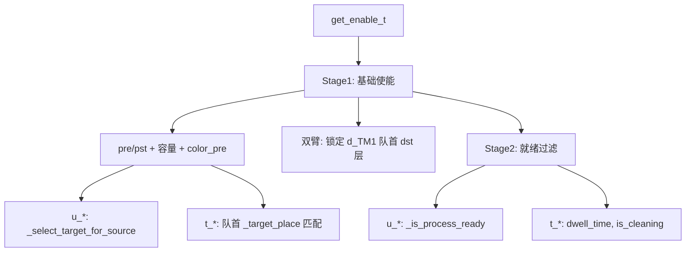
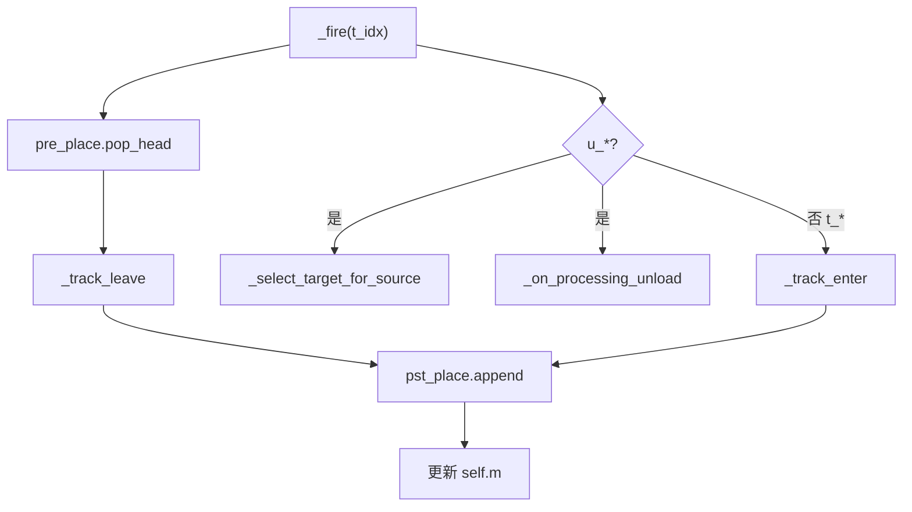
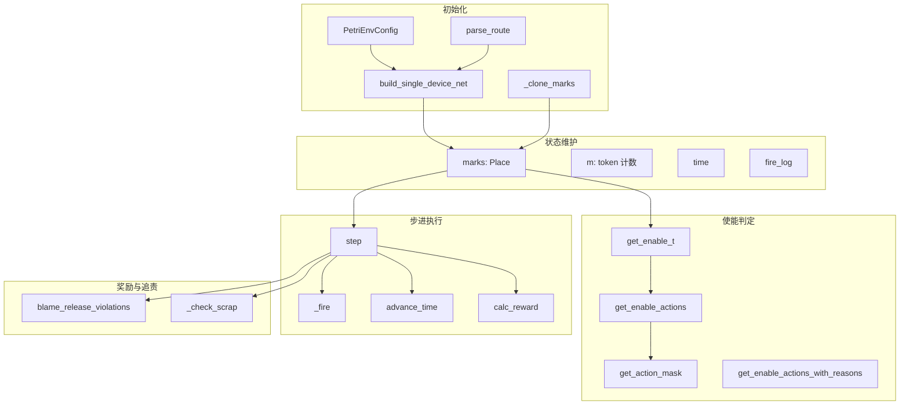

# pn_single.py 架构报告

## 1. 模块概述

**文件**：`[solutions/Continuous_model/pn_single.py](solutions/Continuous_model/pn_single.py)`

**定位**：单设备 Petri 网（构网驱动、单机械手、单动作）的核心仿真引擎，实现连续时间 Petri 网调度逻辑。

**执行链**（模块头部注释）：`construct_single -> _get_enable_t -> step -> calc_reward`

---

## 2. 依赖关系图

---

## 3. 类与核心结构

### 3.1 ClusterTool 类

| 职责  | 说明                                                                             |
| --- | ------------------------------------------------------------------------------ |
| 初始化 | 从 `PetriEnvConfig` 加载配置，调用 `build_single_device_net()` 构建网，解析路由元数据             |
| 状态  | `pre/pst/net/m0/m/k/ptime`（矩阵）、`marks`（Place 列表）、`time`、`fire_log` 等           |
| 动作  | `step()`、`reset()`、`get_enable_t()`、`get_enable_actions()`、`get_action_mask()` |
| 奖励  | `calc_reward()`、`blame_release_violations()`                                   |
| 清洗  | `_init_cleaning_state`、`_advance_cleaning_and_idle`、`_on_processing_unload`    |

### 3.2 常量

- `CHAMBER=1`、`DELIVERY_ROBOT=2`、`SOURCE=3`：库所类型
- `REASON_DESC`：动作不使能原因的人性化描述（供 Markdown 报告、可视化使用）

---

## 4. 主要调用链

### 4.1 初始化链

### 4.2 step 执行链（非 wait）

### 4.3 step 执行链（wait）

### 4.4 使能计算链

### 4.5 _fire 内部链

---

## 5. 模块交互架构图

---

## 6. 方法调用关系汇总

| 入口方法                         | 直接调用                                                                                                         | 间接调用                                                 |
| ---------------------------- | ------------------------------------------------------------------------------------------------------------ | ---------------------------------------------------- |
| `step(a1, wait_duration)`    | `calc_reward`, `advance_time`, `_fire`, `_check_qtime_violation`, `blame_release_violations`, `_check_scrap`, `get_action_mask` | `get_next_event_delta`, `_get_place`, `_clone_marks` |
| `reset()`                    | `_clone_marks`, `_refresh_episode_proc_time`, `get_enable_t`                                                 | `_get_place`                                         |
| `get_enable_t()`             | `_get_place`, `_select_target_for_source`, `_is_process_ready`, `_transport_for_t_target`                    | -                                                    |
| `get_enable_actions()`       | `get_enable_t`, `_has_ready_chamber_wafers`                                                                  | `_get_place`                                         |
| `get_action_mask()`          | `get_enable_actions`                                                                                         | 同上                                                   |
| `_fire(t_idx)`               | `_track_leave`, `_track_enter`, `_select_target_for_source`, `_on_processing_unload`, `_next_robot_machine`  | `_get_place`                                         |
| `advance_time(dt)`           | `_update_stay_times`, `_advance_cleaning_and_idle`                                                           | -                                                    |
| `calc_reward(t1, t2)`        | `_get_place`                                                                                                 | -                                                    |
| `blame_release_violations()` | `_chamber_timeline`, `_release_station_aliases`, `_release_chain_by_u`                                       | -                                                    |

---

## 7. 主链接口约束（mask 优先）

- `ClusterTool.step` 当前统一返回 4 元组：`(done, reward_result, scrap, action_mask)`。
- 训练主链（`Env_PN_Single._step`）直接消费 `step` 返回的 `action_mask`，不再二次构造。
- `enable` 列表仅作为调试/评估可解释信息保留（如 `get_enable_actions_with_reasons`）。

## 8. 文档输出建议

建议将以上内容输出为独立文档：`docs/pn_single_architecture.md`。文档结构可包含：

- Abstract（What/When/Not）
- 模块概述
- 依赖关系
- 调用链（含 Mermaid 图）
- 类与核心方法说明
- Related Docs 链接（pn_api.md、continuous_solution_design.md、env_place_obs.md）

---

### Docs consulted

- `[docs/README.md](docs/README.md)` 文档索引
- `[docs/pn_api.md](docs/pn_api.md)` ClusterTool / PetriSingleDevice API
- `[docs/continuous_solution_design.md](docs/continuous_solution_design.md)` 单设备扩展设计

### Derived constraints

- 执行链固定为 construct_single -> get_enable_t -> step -> calc_reward
- 使能分两阶段：Stage1 结构 + Stage2 就绪/清洗/dwell
- 仅 `u_LP`、`u_LLC`、`u_LLD` 参与 blame_release_violations
- WAIT 存在“加工完成待取片”时仅允许 5s 档位

