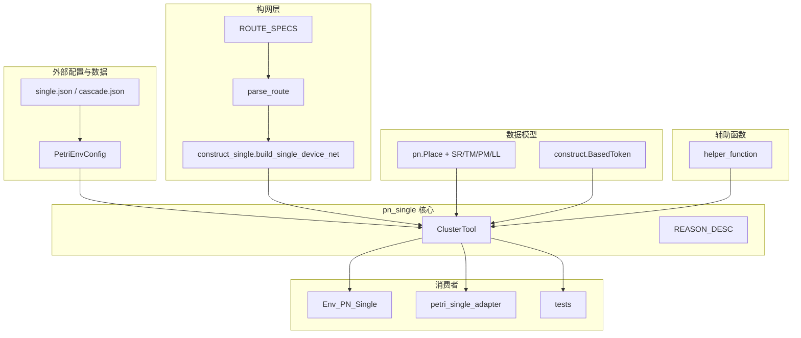
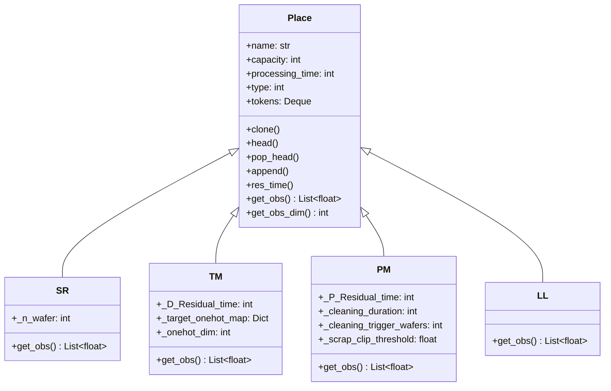
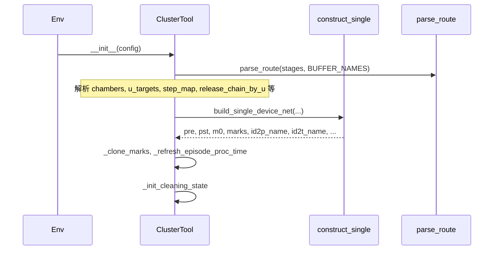
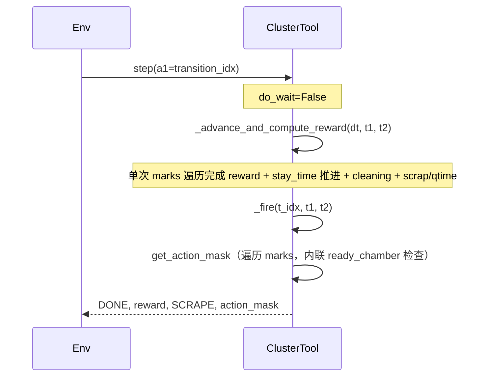
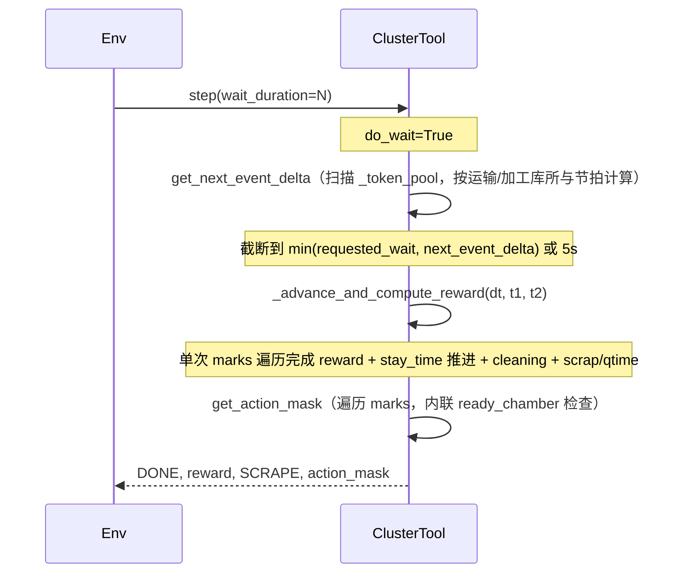
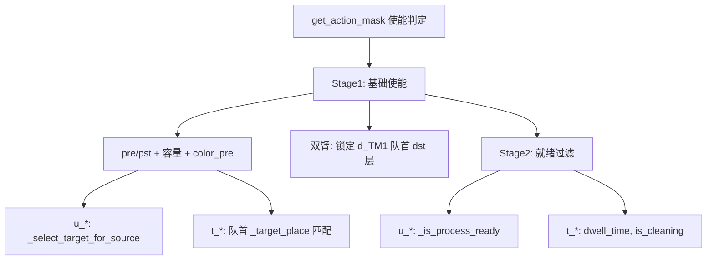
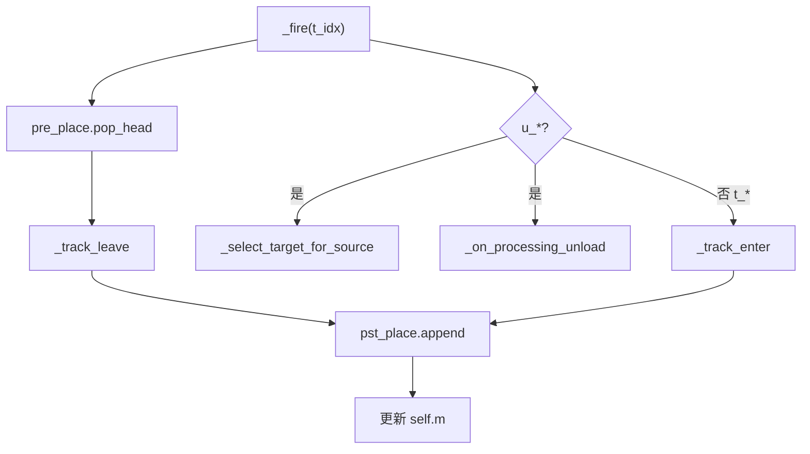
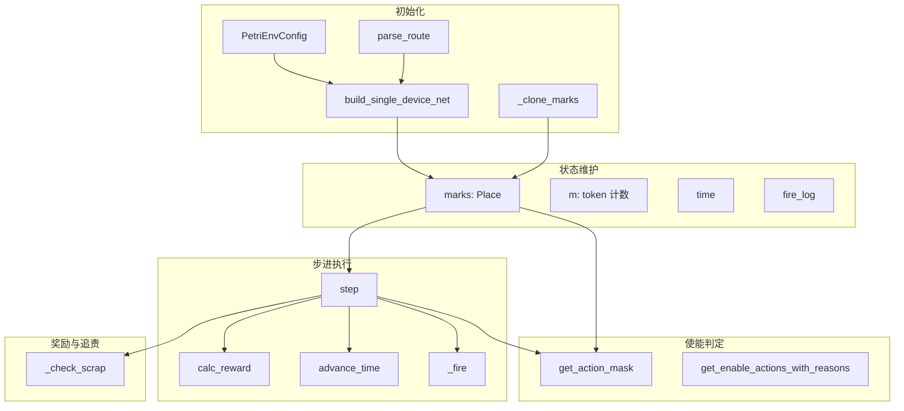

# pn_single.py 架构报告

## 1. 模块概述

**文件**：`[solutions/Continuous_model/pn_single.py](solutions/Continuous_model/pn_single.py)`

**定位**：单设备 Petri 网（构网驱动、单机械手、单动作）的核心仿真引擎，实现连续时间 Petri 网调度逻辑。

**执行链**（模块头部注释）：`construct_single -> get_action_mask -> step -> calc_reward`

---

## 2. 依赖关系图

---

## 3. 类与核心结构

### 3.1 ClusterTool 类

| 职责  | 说明                                                                             |
| --- | ------------------------------------------------------------------------------ |
| 初始化 | 从 `PetriEnvConfig` 加载配置，调用 `build_single_device_net()` 构建网，解析路由元数据             |
| 状态  | `pre/pst/net/m0/m/k/ptime`（矩阵）、`marks`（Place 列表）、`time`、`fire_log` 等           |
| 动作  | `step()`、`reset()`、`get_action_mask()`（使能与 wait 规则在此统一，直接写 mask；`reset()` 返回的 transition 列表来自 `_get_enable_t()`） |
| 观测  | `get_obs()`、`get_obs_dim()`；`step()` 返回 `(done, reward, scrap, action_mask, obs)`；观测构造由 `Place.get_obs` 承担，ClusterTool 仅负责 `_get_obs_place_order` 确定观测顺序并依次调用各库所 `place.get_obs()` 聚合 |
| 奖励  | `calc_reward()`；`blame_release_violations()` 仅在 episode 结束后由训练脚本调用                                   |
| 清洗  | `_init_cleaning_state`、`_advance_cleaning_and_idle`、`_on_processing_unload`    |

### 3.2 Place 类继承结构

库所特征通过 Place 子类实现，各子类在构造时接收类型特定参数，覆写 `get_obs()` 返回对应观测向量。

| 子类 | 库所 | 特征维度 | 构造参数 |
|-----|------|---------|---------|
| **SR** (Source) | LP, LP_done | LP: 1 维；LP_done: 0 维（不进 obs） | n_wafer |
| **TM** (Transport) | d_TM1, d_TM2, d_TM3 | 4 时间 + 4/2 one-hot | D_Residual_time, target_onehot_map, onehot_dim |
| **PM** (Process Module) | PM1, PM3, PM4, PM6, PM7... | 9 维 | P_Residual_time, cleaning_* |
| **LL** (Load Lock) | LLC, LLD | 4 维 | 无额外参数 |

构网时由 `construct_single.build_single_device_net(obs_config=...)` 根据 `obs_config` 创建对应子类实例；`ClusterTool` 传入 `obs_config` 后，`marks` 中为 PM/TM/LL/SR 实例，`_clone_marks` 通过 `place.clone()` 保持子类类型。

### 3.3 常量

- `CHAMBER=1`、`DELIVERY_ROBOT=2`、`SOURCE=3`：库所类型
- `REASON_DESC`：动作不使能原因的人性化描述（供 Markdown 报告、可视化使用）

---

## 4. 主要调用链

### 4.1 初始化链

### 4.2 step 执行链（非 wait）

### 4.3 step 执行链（wait）

### 4.4 使能计算链

### 4.5 _fire 内部链

---

## 5. 模块交互架构图

---

## 6. 方法调用关系汇总

| 入口方法                         | 直接调用                                                                                                         | 间接调用                                                 |
| ---------------------------- | ------------------------------------------------------------------------------------------------------------ | ---------------------------------------------------- |
| `step(a1, wait_duration)`    | `_advance_and_compute_reward`, `_fire`, `get_action_mask` | `get_next_event_delta`, `_get_place` |
| `reset()`                    | `_clone_marks`, `_refresh_episode_proc_time`, `_get_enable_t`                                                | `_get_place`                                         |
| `get_action_mask()`          | 遍历 `marks`（非 `_token_pool`），内联 remaining_time / ready_chamber 检查，缓存 `_select_target_for_source` 结果；内部调用 `_transition_structurally_enabled` | -                                                    |
| `_advance_and_compute_reward(dt, t1, t2)` | 单次 marks 遍历合并：reward 计算 + `stay_time` 推进 + 清洗/idle 推进 + scrap/qtime 检测 | - |
| `_fire(t_idx)`               | `_track_leave`, `_track_enter`, `_select_target_for_source`, `_on_processing_unload`, `_next_robot_machine`  | `_get_place`                                         |
| `calc_reward(t1, t2)`        | **已废弃**，由 `_advance_and_compute_reward` 内联替代                                                             | -                                                    |
| `advance_time(dt)`           | **已废弃**，由 `_advance_and_compute_reward` 内联替代                                                             | -                                                    |
| `blame_release_violations()` | `_chamber_timeline`, `_release_station_aliases`, `_release_chain_by_u`                                       | -                                                    |

---

## 7. 主链接口约束（mask 优先）

- `ClusterTool.step` 当前统一返回 4 元组：`(done, reward_result, scrap, action_mask)`。
- 训练主链（`Env_PN_Single._step`）直接消费 `step` 返回的 `action_mask`，不再二次构造。
- `enable` 列表仅作为调试/评估可解释信息保留（如 `get_enable_actions_with_reasons`）。

## 8. 文档输出建议

建议将以上内容输出为独立文档：`docs/pn_single_architecture.md`。文档结构可包含：

- Abstract（What/When/Not）
- 模块概述
- 依赖关系
- 调用链（含 Mermaid 图）
- 类与核心方法说明
- Related Docs 链接（pn_api.md、continuous_solution_design.md、env_place_obs.md）

---

### Docs consulted

- `[docs/README.md](docs/README.md)` 文档索引
- `[docs/pn_api.md](docs/pn_api.md)` ClusterTool / PetriSingleDevice API
- `[docs/continuous_solution_design.md](docs/continuous_solution_design.md)` 单设备扩展设计

### Derived constraints

- 执行链固定为 construct_single -> get_action_mask（使能）/ step -> _advance_and_compute_reward
- 使能判定在 get_action_mask 中完成，遍历 marks 而非 _token_pool
- 仅 `u_LP`、`u_LLC`、`u_LLD` 参与 blame_release_violations
- WAIT 存在“加工完成待取片”时仅允许 5s 档位

